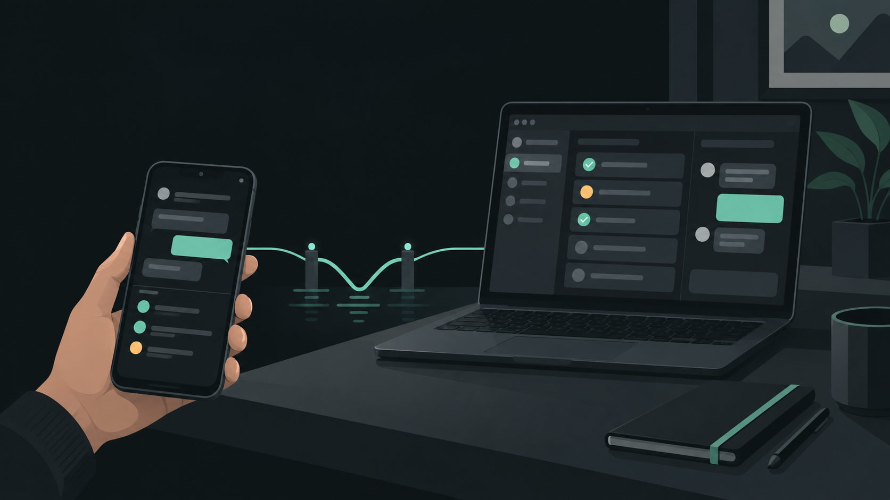
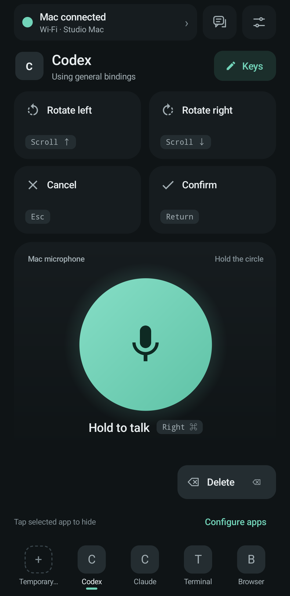
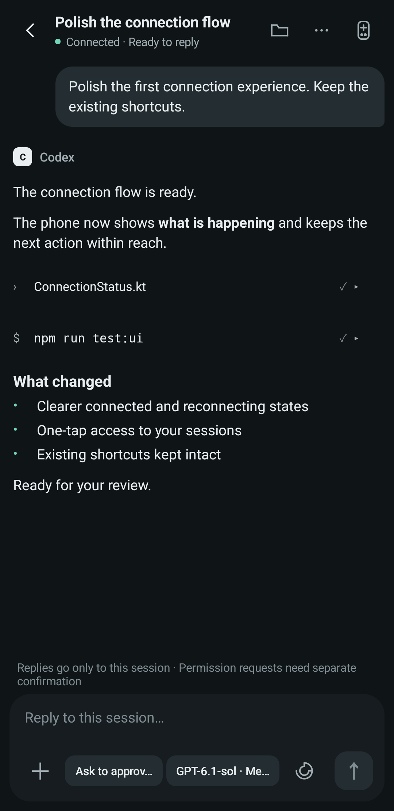

<p align="center">
  
</p>
<h1 align="center">VibePier</h1>
<p align="center"><strong>Your AI coding workspace, within reach.</strong><br>Continue Mac coding sessions and control your desktop from an Android phone.</p>
<p align="center">English · <a href="README.zh-CN.md">简体中文</a> · <a href="docs/SETUP.md">Setup</a> · <a href="docs/README.md">Documentation</a> · <a href="CONTRIBUTING.md">Contribute</a></p>



VibePier pairs a native Android remote with a macOS menu bar app. Read and continue supported Codex, Claude Code, and ZCode sessions; handle supported approvals; use application shortcuts, configurable keys, and optional phone microphone input. An optional self-hosted relay keeps the connection available across networks.

**[Download v0.1.0-beta.1](https://github.com/JunWeiUp/vibepier/releases/tag/v0.1.0-beta.1)** · Android 13+ · Apple-silicon Mac · Self-hosted Linux relay

This is an early preview. Real first-message acceptance was explicitly skipped for this release; see the [release review](docs/RELEASE-REVIEW.md) and [known follow-ups](TODO.md). The illustrations show the product concept, not screenshots of the app.

## What it does

| Area | What you can do |
| --- | --- |
| AI sessions | Browse supported sessions, read conversation updates, send messages and attachments, and handle supported approvals or questions. Availability depends on the provider and desktop version. |
| Desktop controls | Configure six remote controls and per-application bindings; choose installed Mac apps on the phone, then open or hide them. |
| Project files | Browse the session workspace, search names, read source/Markdown/images, inspect Git diffs and quote files into a draft. See [Project files](docs/PROJECT-FILES.md). |
| Codex usage | View remaining quota, reset times and gifted reset cards from the session-list menu. Redeeming a card requires a separate confirmation; credentials stay on the Mac. |
| Screen controls | Use **Lock** and **Unlock** from the phone's session-list menu. Unlocking requires a password explicitly configured and verified on the Mac; it stays in private local Mac preferences and survives app updates. |
| Connections | Enroll over Bluetooth, then use Bluetooth, local Wi-Fi, or your own WSS relay. The relay can negotiate a direct UDP path. |
| Voice | Use the Mac microphone, or route phone audio over Bluetooth/Wi-Fi/direct UDP with a compatible virtual audio device. Phone audio is not sent through the relay. |
| Optional hardware | Use an Ulanzi Vibe Key AU05 for physical controls. A dongle is not required for the phone remote. |

## On your phone

<table>
  <tr>
    <td width="50%" align="center">
      <strong>Home</strong><br>
      <sub>Shortcuts, voice and app switching.</sub><br><br>
      
    </td>
    <td width="50%" align="center">
      <strong>Conversation</strong><br>
      <sub>Follow replies, inspect changes and keep working.</sub><br><br>
      
    </td>
  </tr>
</table>

<sub>Native Android screens with demonstration connection state and conversation content. [About these screenshots](assets/previews/README.md).</sub>

## Provider support

| Capability | Codex | Claude Code | ZCode |
| --- | --- | --- | --- |
| Sessions, history and scoped Markdown | Verified desktop or VibePier-owned App Server session | Local transcripts and supported desktop state | Read-only native history |
| Replies, new sessions, settings and interrupt | Existing desktop owner, or healthy owned App Server session; background replies require idle | Depends on desktop/terminal ownership and available CLI | Verified native session and supported menus required |
| Attachments | Supported | Inline images on new sessions; file references in the prompt | Unavailable |
| Approvals and questions | Recognized native/async requests | Recognized, unambiguous desktop requests | Unavailable |
| Follow-up queue and steering | Compatible desktop threads only | No equivalent queue controls | Unavailable |

Codex desktop compatibility is checked through native interfaces and receipts; desktop build numbers alone do not disable sessions or settings. Phone-created Codex sessions now use the bundled App Server in the background with the Mac's existing account, so creation does not require unlocking the Mac. A persistent registry keeps those sessions on that backend; existing desktop sessions retain their original IPC owner. Background sessions accept messages while idle and do not offer queue, steer or queue deletion. A live Claude terminal session is not resumed through a competing process. ZCode new-session support has additional native-provider restrictions. See the [compatibility guide](docs/COMPATIBILITY.md) for native-contract and acceptance limits.

Codex new-session options include a Fast mode checkbox for supported models, effective from the first message. Fast mode may increase usage.

## Quick start

You need **macOS 14+ on Apple silicon** and **Android 13+**. Keep the Mac app running; remote operation does not power on a shut-down Mac or bypass FileVault's pre-login screen.

1. Install **VibePier.app** in `/Applications` and open it. The first installed launch opens the Full Disk Access guide and System Settings. Add/enable VibePier, quit and reopen it, then install the signed Android APK.
2. Allow the Bluetooth/nearby-device permissions needed for discovery. On a fresh installation the phone starts with Bluetooth.
3. The phone requests access automatically. Confirm **Allow this phone** on the Mac. You do not need to open the conversation list to request access.
4. Allow macOS Accessibility for desktop key/application controls when prompted. Grant microphone access only when using voice features.
5. Once the phone displays **Mac connected**, open the session list or use the remote controls.

The preview Mac package is not notarized. Use macOS's normal explicit approval flow; do not disable Gatekeeper. Each phone must be approved separately. Details: [installation and permissions](docs/SETUP.md), [connections and troubleshooting](docs/CONNECTIONS.md).


Current source build 11 (not included in the published build 8) fixes recording-path cleanup, attachment restoration, task controls, update stages and indexed Claude history; see [improvements](docs/PROJECT-IMPROVEMENTS.md).

APK delivery over the cloud relay requires build 9+ on both apps and supports negotiated larger fragments and four concurrent chunks, with download speed and remaining-time estimates. Both apps must be upgraded; see [Android updates](docs/ANDROID-UPDATES.md).

## Deploy your own relay

The relay is optional. It is a small Go service behind Nginx HTTPS, with no database. VibePier does not provide a hosted relay.

**Requirements:** a Linux server with SSH and sudo access, systemd 247+, a domain pointing to it, and a working HTTPS Nginx site. Keep TCP 443 reachable. The relay binds to `127.0.0.1:47801`; do not expose that port directly. Build on a machine with Go 1.22+.

### 1. Build and install the service

Run from this repository on your development machine. Replace the example values:

```sh
export RELAY_HOST='ubuntu@YOUR_SERVER_IP'
export RELAY_DOMAIN='relay.example.com'

./services/relay/deploy.sh "$RELAY_HOST" amd64
# Use arm64 instead of amd64 for an ARM Linux server.
```

The script installs `/usr/local/bin/vibepier-relay`, enables `vibepier-relay.service`, and creates a root-only secret at `/etc/vibepier-relay/secret`. Updating the service preserves that secret. It does not edit your Nginx site or print the secret.

```sh
ssh "$RELAY_HOST" 'sudo systemctl status vibepier-relay --no-pager'
ssh "$RELAY_HOST" 'curl -s -o /dev/null -w "%{http_code}\n" http://127.0.0.1:47801/'
```

The HTTP check should return **426**: the process is reachable and expects a WebSocket upgrade. This alone does not prove client authentication or end-to-end delivery.

### 2. Add the HTTPS WebSocket route

Copy the supplied snippet to the server:

```sh
scp services/relay/nginx-vibepier-relay.conf "$RELAY_HOST:/tmp/vibepier-relay.conf"
ssh -t "$RELAY_HOST" 'sudo install -m 0644 /tmp/vibepier-relay.conf /etc/nginx/snippets/vibepier-relay.conf && sudo rm /tmp/vibepier-relay.conf'
```

Inside the existing `server { listen 443 ssl; ... }` block for your domain, add:

```nginx
include /etc/nginx/snippets/vibepier-relay.conf;
```

The included route is:

```nginx
location = /vibepier/relay {
    proxy_pass http://127.0.0.1:47801;
    proxy_http_version 1.1;
    proxy_set_header Upgrade $http_upgrade;
    proxy_set_header Connection "upgrade";
    proxy_set_header Host $host;
    proxy_set_header X-Real-IP $remote_addr;
    proxy_read_timeout 120s;
    proxy_send_timeout 120s;
    proxy_buffering off;
}
```

Validate, reload, and check the public route:

```sh
ssh -t "$RELAY_HOST" 'sudo nginx -t && sudo systemctl reload nginx'
curl -s -o /dev/null -w '%{http_code}\n' "https://$RELAY_DOMAIN/vibepier/relay"
```

Expect **426**, with a valid certificate. If HTTPS is not set up yet, follow [Certbot's Nginx instructions](https://certbot.eff.org/instructions?os=snap&tab=standard&ws=nginx). See also [Nginx WebSocket proxying](https://nginx.org/en/docs/http/websocket.html).

### 3. Configure the Mac without putting the secret in shell history

Start VibePier on the Mac. With the `vibepier` CLI installed, import the server secret through a temporary private file. This SSH command requires passwordless sudo for the read; the [deployment guide](docs/DEPLOYMENT.md#retrieving-the-secret-when-sudo-needs-a-password) covers interactive sudo.

```sh
umask 077
mkdir -p "$HOME/.config/vibepier"
export RELAY_SECRET_FILE="$HOME/.config/vibepier/relay-import.secret"
ssh "$RELAY_HOST" 'sudo -n cat /etc/vibepier-relay/secret' > "$RELAY_SECRET_FILE"

vibepier relay configure \
  --url "wss://$RELAY_DOMAIN/vibepier/relay" \
  --room 'my-mac' \
  --secret-file "$RELAY_SECRET_FILE"
vibepier relay status
rm "$RELAY_SECRET_FILE"
```

The CLI passes the settings to the running Mac app through its private local socket. The app saves the secret in Keychain, not ordinary JSON configuration. You can also configure the same endpoint, room, and secret in **Phone remote → Cloud relay** on the Mac. Choose a different room for each Mac.

### 4. Connect the phone and verify delivery

Keep the approved phone on Bluetooth briefly: it securely receives the relay settings from the Mac and saves them with Android Keystore encryption. Then select **Cloud relay** on the phone. No second device enrollment is required.

The Mac should report an online phone, and the phone should show the current Mac application. **Direct connection · Ready** means the relay successfully negotiated a direct path; it does not mean the relay settings were ignored. Test from cellular data as well before depending on cross-network access.

For logs, upgrades, rotation, proxy configuration, and rollback, see [the deployment guide](docs/DEPLOYMENT.md).

System DNS is the default. Optional Android AliDNS HTTPS recovery requires explicit opt-in; see [configuration and privacy tradeoffs](docs/DEPLOYMENT.md#optional-android-dns-recovery).

## Build and contribute

Mac: Xcode with Swift 6 and Go 1.22+ for the bundled file helper. Android: JDK 17 and Android SDK 35. Relay: Go 1.22+. Build/package commands create artifacts without installing them or changing your system settings.

```sh
make test
make lint
./scripts/build/macos.sh
./apps/android/gradlew -p apps/android :app:assembleDebug
make package-relay
```

The Mac app is staged at `dist/staging/VibePier.app`. Install it explicitly if needed. To build and install just the CLI:

```sh
swift build --package-path apps/macos -c release --product vibepier
mkdir -p "$HOME/.local/bin"
install -m 0755 "$(swift build --package-path apps/macos -c release --show-bin-path)/vibepier" "$HOME/.local/bin/vibepier"
go -C services/relay build -trimpath -o "$HOME/.local/bin/VibePierFileServer" ./cmd/vibepier-file-server
export PATH="$HOME/.local/bin:$PATH"
```

Signed Android packaging requires your own release-key environment variables; it never silently falls back to a debug key. See [the deployment guide](docs/DEPLOYMENT.md#android-signing).

```text
apps/macos/       Native app, reusable core, AU05 library, CLI
apps/android/     Native Android remote, organized by feature
services/relay/   Independent Go relay module and service configuration
protocol/         Wire specifications and shared fixtures
assets/           Editable brand files and README illustrations
scripts/          Build, development, and release tools
docs/             Product, contributor, and operational documentation
```


Use **Configure apps** above the phone’s bottom dock to choose installed Mac applications. Tap an empty slot to assign it, or long-press a saved app to replace or clear it. Selections sync to the Mac and other authorized phones; choosing an app does not launch it.

Portable shortcut/device settings can be [exported and imported](docs/SETTINGS-TRANSFER.md) without copying credentials or conversations.

## Privacy and limits

Every control path requires device authorization. Control traffic uses authenticated encryption; provider credentials remain on the Mac. A relay operator can observe connection metadata and encrypted packet sizes. Saving an unlock password, usage tracking, and phone microphone access are optional. There is no promise of compatibility with every future desktop-provider version.

## Documentation and contribution

| Start here | Guides |
| --- | --- |
| Use VibePier | [Setup](docs/SETUP.md) · [Connections](docs/CONNECTIONS.md) · [Compatibility](docs/COMPATIBILITY.md) |
| Operate or move it | [Deployment](docs/DEPLOYMENT.md) · [Mac updates and permissions](docs/MACOS-UPDATES.md) · [Migration](docs/MIGRATION.md) · [Portable settings](docs/SETTINGS-TRANSFER.md) |
| Understand the project | [Product scope](docs/PROJECT-SPEC.md) · [Architecture](docs/ARCHITECTURE.md) · [Design](DESIGN.md) · [Screens](docs/PAGE-STRUCTURE.md) |
| Agent protocol and optional runtimes | [Unified control](docs/AGENT-CONTROL-ARCHITECTURE.md) · [Session API](protocol/specs/agent-session.md) |
| Contribute | [Contribution guide](CONTRIBUTING.md) · [Components](docs/COMPONENT-GUIDELINES.md) · [Development](docs/DEVELOPMENT.md) · [AGENTS.md](AGENTS.md) |
| Review a release | [Artifacts and distribution](docs/REGISTRY.md) · [Changelog](CHANGELOG.md) · [Release gates](TODO.md) |

[All documentation](docs/README.md) includes security, privacy, background connection and launch material. Contributions are welcome; use synthetic reproductions and preserve provider compatibility and authorization boundaries.

## License and provenance

MIT. VibePier builds on the AU05 driver work in `ihavespoons/vibed`. The original copyright and license are preserved in [LICENSE](LICENSE), with project provenance in [NOTICE](NOTICE).

[Security](SECURITY.md) · [Privacy](docs/PRIVACY.md)

[Provenance and asset sources](docs/PROVENANCE.md)

Task completion alerts are available on connected Android phones, including in the background. Enable **Task completion notifications** in phone settings. [Behavior and limitations](docs/TASK-NOTIFICATIONS.md).

- [Android versions and update indicators / Android 版本与更新红点](docs/ANDROID-UPDATES.md)

Conversation/project images and MP4 previews use the raw HTTPS binary file channel shared with uploads and APKs; see [binary file transfers](docs/BINARY-FILE-TRANSFER.md). LAN/public IPv6 candidates and relay are probed concurrently; automatic IPv4 NAT traversal is unsupported.

Assistant visibility is configured in the Mac menu’s **AI coding assistants** card. Only enabled providers appear on the updated phone app; running desktop tasks and saved drafts remain intact. [Details](docs/PROVIDER-VISIBILITY.md).

### Agent control development

The development source uses a typed Agent Session profile over the existing authorized encrypted channel. Capability negotiation controls which actions are available, and desktop and optional runtime backends keep separate targets and pending operations. Mac and Android require a coordinated update for fresh Agent writes; existing unknown receipts keep their original lookup path.

The phone composer now offers **Task mode → Plan / Execute**, including in new-session options. Codex uses native collaboration modes; Claude Code uses its native plan permission mode. The phone displays a confirmed change only after native readback. Availability depends on the selected backend, compatible native interface and idle session. [Plan mode support and limits](docs/COMPATIBILITY.md#phone-plan-mode--手机计划模式).

Phone actions reconnect and obtain current native control state automatically. Standard Send submits to the selected conversation using its current settings, entering the native queue when supported and needed; App Server sessions created by VibePier require idle and have no queue controls. Stops, approvals and queue changes retain the selected target, and explicit permission changes retain their confirmation. Uncertain submissions keep their original receipt without automatic resend.

The default `codex.currentV1` adapter creates owned background sessions through the bundled App Server using the Mac's native Codex home and account. Its model, effort, permissions, Plan / Execute, Fast mode and attachment choices still require native confirmation. Separately, optional backends are configured locally with `vibepier agents status` and explicit enable commands. The optional Codex driver uses a private socket and separate `CODEX_HOME`; the desktop must explicitly connect to that runtime. The Claude Code Mods prototype remains observation-only until its exact runtime contract and native delivery evidence are accepted. Local installation and actual native delivery are verified separately. See [setup and acceptance boundaries](docs/AGENT-CONTROL-ARCHITECTURE.md#本地可选运行时--optional-local-runtime-setup).

Claude model selection reads the configured API’s actual model directory and displays full versions (for example, Opus 5.5); reasoning effort is selected separately. Desktop-owned sessions retain native model menus. See [compatibility](docs/COMPATIBILITY.md) for discovery requirements.
