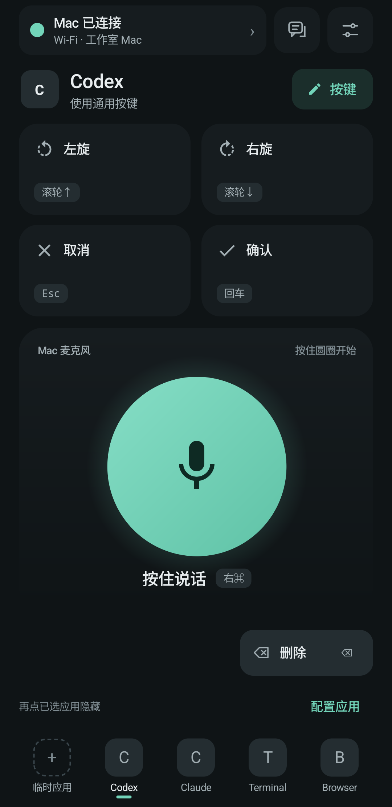
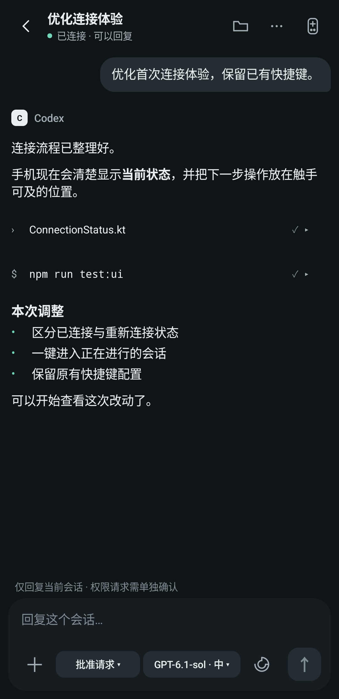

<p align="center"></p>
<h1 align="center">VibePier</h1>
<p align="center"><strong>离开键盘，也能接着推进。</strong><br>用 Android 手机继续 Mac 上的 AI 编程会话，并控制桌面。</p>
<p align="center"><a href="README.md">English</a> · 简体中文 · <a href="docs/SETUP.md">安装说明</a> · <a href="docs/README.md">文档导航</a> · <a href="CONTRIBUTING.md">参与贡献</a></p>


VibePier 由原生 Android 遥控器、macOS 菜单栏应用和可选的自建中继组成。它支持查看和继续适配版本的 Codex、Claude Code、ZCode 会话，也提供按键、应用切换与语音入口。手机不需要 AU05 硬件即可使用。

**[下载 v0.1.0-beta.1](https://github.com/JunWeiUp/vibepier/releases/tag/v0.1.0-beta.1)** · Android 13+ · Apple silicon Mac · 自建 Linux 中继

当前为早期预览版。本次按维护者决定跳过真实首条发送验收，未验收项与已知限制见[发布检查](docs/RELEASE-REVIEW.md)和[后续计划](TODO.md)。本文插画表达产品概念，并非应用截图。

## 能做什么

| 功能 | 说明 |
| --- | --- |
| AI 会话 | 浏览已支持的会话、阅读更新、发送消息与附件、处理适配的审批或问答；能力取决于会话来源与桌面版本。 |
| 桌面遥控 | 六个控制按键、应用专属绑定、在手机选择已安装的 Mac 应用，并打开或隐藏应用。 |
| 项目文件 | 浏览会话目录、搜索文件名、查看源码/Markdown/图片及 Git diff，将路径引用到回复草稿。见[项目文件说明](docs/PROJECT-FILES.md)。 |
| Codex 使用情况 | 会话列表菜单查看剩余额度、重置时间和赠送的重置卡；使用卡片需再次确认，账户凭据只保留在 Mac。 |
| 锁屏与解锁 | 会话列表右上角菜单提供“锁屏”“解锁”；解锁需事先设置并由 Mac 校验登录密码，密码仅保存在 Mac 钥匙串。 |
| 多种连接 | 首次蓝牙授权，之后可用蓝牙、同网 Wi-Fi 或自建 WSS 中继；中继支持协商 UDP 直连。 |
| 语音 | 使用 Mac 麦克风，或配合虚拟音频设备，通过蓝牙、Wi-Fi、UDP 直连传输手机音频；云中继不转发手机音频。 |
| 可选 AU05 | 可连接 Ulanzi Vibe Key AU05，使用实体按键与相关硬件设置。 |

## 手机界面

<table>
  <tr>
    <td width="50%" align="center">
      <strong>首页</strong><br>
      <sub>快捷控制、语音输入与应用切换。</sub><br><br>
      
    </td>
    <td width="50%" align="center">
      <strong>会话</strong><br>
      <sub>阅读回复、查看改动，继续推进任务。</sub><br><br>
      
    </td>
  </tr>
</table>

<sub>原生 Android 界面，连接状态和会话内容使用演示数据。[截图说明](assets/previews/README.md)。</sub>

## 不同会话来源的能力

| 能力 | Codex | Claude Code | ZCode |
| --- | --- | --- | --- |
| 会话、历史与受限 Markdown 阅读 | 兼容桌面版本的订阅 | 本地记录与适配的桌面状态 | 原生记录只读访问 |
| 回复、新建、设置与停止 | 需匹配构建版本和原会话归属 | 取决于桌面/终端占用状态和 CLI | 需校验原生会话与可用菜单 |
| 附件 | 支持 | 新会话图片直接发送；其他附件作为文件引用 | 不支持 |
| 审批与问答 | 识别出的原生/异步请求 | 已适配且无歧义的桌面请求 | 不支持 |
| 后续消息队列与引导 | 支持 | 不支持对应队列功能 | 不支持 |

Codex 当前允许桌面构建号 **11645、12404、12553、12947**；配置式新建适配针对 **12553、12947** 和已保存的单根项目，原生界面仍待现场验收。Claude 终端占用的会话不会被另起进程续写；ZCode 新建会话还受原生 provider 配置限制。具体使用前请看[兼容性说明](docs/COMPATIBILITY.md)，不要将源码已接入等同于所有桌面版本均可用。

## 快速开始

需要 **Apple silicon Mac、macOS 14+** 和 **Android 13+**。Mac 应用需要保持运行，不能远程开机，也不能绕过 FileVault 开机登录。

1. 安装并打开 Mac 上的 **VibePier.app**，在手机安装正式签名 APK。
2. 允许蓝牙/附近设备权限。新安装默认通过蓝牙发现 Mac。
3. 手机自动发起授权，只需在 Mac 弹窗点 **允许这台手机**，不必进入会话页点“申请访问”。
4. 使用桌面按键和应用控制时，按提示允许 Mac 辅助功能权限；使用语音时再开启对应麦克风权限。
5. 手机显示 **Mac 已连接** 后，即可进入会话列表或使用遥控。

Mac 预览包尚未公证，请使用系统正常的明确确认流程，不要关闭 Gatekeeper。每台手机单独授权。详见[安装与权限](docs/SETUP.md)、[连接说明](docs/CONNECTIONS.md)。

## 自建云中继：部署命令与接入方法

同一网络或蓝牙连接不需要中继。跨网络使用时，可在自己的 Linux 服务器部署；项目不提供公共托管中继，也不需要数据库。

**准备条件：** 能通过 SSH 和 sudo 管理的 Linux 服务器、systemd 247+、指向服务器的域名、已配置有效证书的 Nginx HTTPS 站点；公网开放 TCP 443。中继只监听 `127.0.0.1:47801`，无需把 47801 直接开放到公网。本地构建需要 Go 1.22+。

### 1. 部署中继进程

在仓库根目录运行，将示例主机与域名换成自己的：

```sh
export RELAY_HOST='ubuntu@YOUR_SERVER_IP'
export RELAY_DOMAIN='relay.example.com'

./services/relay/deploy.sh "$RELAY_HOST" amd64
# ARM 服务器把 amd64 换成 arm64。
```

脚本会编译并上传中继，安装 `/usr/local/bin/vibepier-relay`，启用 `vibepier-relay.service`。首次部署生成 `/etc/vibepier-relay/secret`，只允许 root 读取；升级保留该密钥。脚本不会打印密钥，也不会自动改动现有 Nginx 站点。

```sh
ssh "$RELAY_HOST" 'sudo systemctl status vibepier-relay --no-pager'
ssh "$RELAY_HOST" 'curl -s -o /dev/null -w "%{http_code}\n" http://127.0.0.1:47801/'
```

应显示服务运行，HTTP 返回 **426**，表示进程正常且需要 WebSocket 升级。426 只验证入口，不代表客户端认证和实际数据传输已成功。

### 2. 配置 Nginx / WSS

先复制反向代理片段：

```sh
scp services/relay/nginx-vibepier-relay.conf "$RELAY_HOST:/tmp/vibepier-relay.conf"
ssh -t "$RELAY_HOST" 'sudo install -m 0644 /tmp/vibepier-relay.conf /etc/nginx/snippets/vibepier-relay.conf && sudo rm /tmp/vibepier-relay.conf'
```

在对应域名现有的 `server { listen 443 ssl; ... }` 块内加入：

```nginx
include /etc/nginx/snippets/vibepier-relay.conf;
```

该片段内容如下，只代理 `/vibepier/relay`：

```nginx
location = /vibepier/relay {
    proxy_pass http://127.0.0.1:47801;
    proxy_http_version 1.1;
    proxy_set_header Upgrade $http_upgrade;
    proxy_set_header Connection "upgrade";
    proxy_set_header Host $host;
    proxy_set_header X-Real-IP $remote_addr;
    proxy_read_timeout 120s;
    proxy_send_timeout 120s;
    proxy_buffering off;
}
```

验证配置后重载，并检查公网入口：

```sh
ssh -t "$RELAY_HOST" 'sudo nginx -t && sudo systemctl reload nginx'
curl -s -o /dev/null -w '%{http_code}\n' "https://$RELAY_DOMAIN/vibepier/relay"
```

应返回 **426**，且证书校验正常。如果还没有 HTTPS，可按 [Certbot 官方 Nginx 指南](https://certbot.eff.org/instructions?os=snap&tab=standard&ws=nginx)配置证书；WebSocket 代理机制见 [Nginx 官方说明](https://nginx.org/en/docs/http/websocket.html)。不要使用 `curl -k` 掩盖证书问题。

### 3. 配置 Mac

先运行 Mac 上的 VibePier，再使用 `vibepier` CLI 导入密钥。通过私有临时文件传递，避免密钥进入命令历史。下面读取命令要求 SSH 用户可以执行无密码 sudo；需要输入 sudo 密码时，按[部署文档的替代方法](docs/DEPLOYMENT.md#retrieving-the-secret-when-sudo-needs-a-password)操作。

```sh
umask 077
mkdir -p "$HOME/.config/vibepier"
export RELAY_SECRET_FILE="$HOME/.config/vibepier/relay-import.secret"
ssh "$RELAY_HOST" 'sudo -n cat /etc/vibepier-relay/secret' > "$RELAY_SECRET_FILE"

vibepier relay configure \
  --url "wss://$RELAY_DOMAIN/vibepier/relay" \
  --room 'my-mac' \
  --secret-file "$RELAY_SECRET_FILE"
vibepier relay status
rm "$RELAY_SECRET_FILE"
```

密钥通过本机私有 socket 交给正在运行的 Mac 应用，保存在钥匙串；普通配置文件只保存地址与房间。也可在 Mac 的 **手机遥控 → 云中继** 手动填写这三项。多台 Mac 使用不同房间。

### 4. 手机接入并验证

让已授权手机通过蓝牙连接 Mac，手机会自动、安全地同步中继配置，并用 Android Keystore 加密保存。然后在手机连接方式中选择 **云中继**，不必重复授权。

Mac 应显示手机在线，手机应能显示 Mac 当前应用。如果手机显示 **直连 · 控制就绪**，表示中继已成功协商直连，中继配置仍然有效。正式依赖跨网络使用前，再切到蜂窝网络做一次实际验证。

服务日志、升级、密钥轮换、代理和回滚方法见 [DEPLOYMENT.md](docs/DEPLOYMENT.md)。

手机默认使用系统 DNS。只有明确开启后才会使用 AliDNS HTTPS 恢复；配置命令与隐私影响见[可选 DNS 恢复](docs/DEPLOYMENT.md#optional-android-dns-recovery)。

## 本地开发

Mac 需要带 Swift 6 的 Xcode；Android 需要 JDK 17、Android SDK 35；中继需要 Go 1.22+。构建和打包不会自动安装应用或修改系统配置。

```sh
make test
make lint
./scripts/build/macos.sh
./apps/android/gradlew -p apps/android :app:assembleDebug
make package-relay
```

Mac 应用产物为 `dist/staging/VibePier.app`。CLI 可单独构建、安装：

```sh
swift build --package-path apps/macos -c release --product vibepier
mkdir -p "$HOME/.local/bin"
install -m 0755 "$(swift build --package-path apps/macos -c release --show-bin-path)/vibepier" "$HOME/.local/bin/vibepier"
export PATH="$HOME/.local/bin:$PATH"
```

Android 正式打包必须提供自己的 release 签名配置，不会偷偷使用 debug 签名。具体变量见[部署文档](docs/DEPLOYMENT.md#android-signing)。

```text
apps/macos/       Mac 应用、核心逻辑、AU05 库、CLI
apps/android/     按功能组织的原生 Android 客户端
services/relay/   独立 Go 中继模块与服务配置
protocol/         协议说明和跨平台测试样本
assets/           可编辑品牌素材与 README 插画
scripts/          构建、开发、发布工具
docs/             产品、开发与部署文档
```


点击手机底部快捷栏上方的 **配置应用**，即可搜索和选择 Mac 已安装的应用；也可点击空位添加，长按已有应用更换或清空。配置同步到 Mac 和其他已授权手机，选择应用不会立即启动它。

快捷键、设备设置和应用入口支持[安全导出与导入](docs/SETTINGS-TRANSFER.md)，不复制凭据、授权或会话数据。

## 隐私与边界

控制通道必须先授权，并使用认证加密；模型服务凭据留在 Mac。中继运营者能看到连接元信息与加密包大小。自动解锁、使用统计、手机麦克风均需要另外开启。桌面应用接口可能变化，不保证支持所有未来版本。

## 文档与贡献

| 要做什么 | 对应文档 |
| --- | --- |
| 开始使用 | [安装与权限](docs/SETUP.md) · [连接说明](docs/CONNECTIONS.md) · [兼容性](docs/COMPATIBILITY.md) |
| 部署或迁移 | [部署运维](docs/DEPLOYMENT.md) · [迁移更新](docs/MIGRATION.md) · [设置导入导出](docs/SETTINGS-TRANSFER.md) |
| 了解项目 | [产品范围](docs/PROJECT-SPEC.md) · [架构](docs/ARCHITECTURE.md) · [设计](DESIGN.md) · [页面结构](docs/PAGE-STRUCTURE.md) |
| 参与开发 | [贡献说明](CONTRIBUTING.md) · [组件规范](docs/COMPONENT-GUIDELINES.md) · [开发验证](docs/DEVELOPMENT.md) · [AGENTS.md](AGENTS.md) |
| 检查发布 | [产物分发](docs/REGISTRY.md) · [更新记录](CHANGELOG.md) · [验收清单](TODO.md) |

[完整文档导航](docs/README.md)还包括安全、隐私、后台连接与宣传文案。欢迎参与适配和测试；问题复现请使用合成数据，并保留会话归属、权限及兼容性检查。

## 许可与来源

采用 MIT 许可。VibePier 基于 `ihavespoons/vibed` 的 AU05 驱动工作发展而来，原版权声明完整保留在 [LICENSE](LICENSE)，项目来源见 [NOTICE](NOTICE)。

[安全说明](SECURITY.md) · [隐私说明](docs/PRIVACY.md)

[项目与素材来源](docs/PROVENANCE.md)

支持在已连接的 Android 手机上接收任务完成通知，切到后台也可提醒；请在手机设置中开启「任务完成通知」。[使用说明与限制](docs/TASK-NOTIFICATIONS.md)。

- [Android versions and update indicators / Android 版本与更新红点](docs/ANDROID-UPDATES.md)
