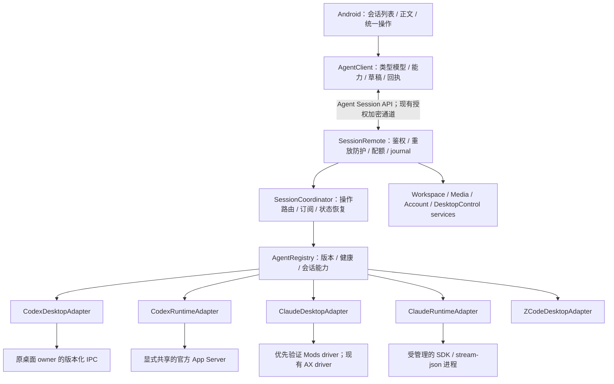
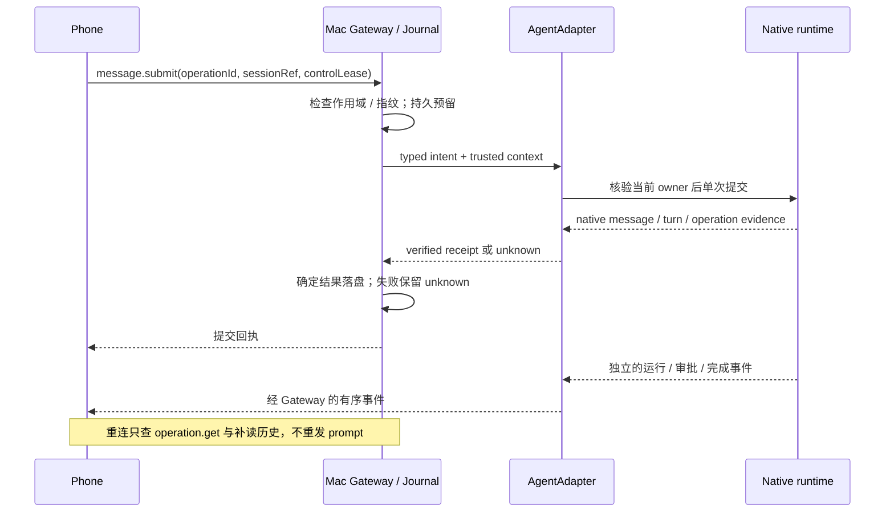

# Unified agent control / 统一 Agent 控制架构

**状态：开发实现已接入双端，安装与真实原生效果分别验收。** `AgentSessionService`、Android typed client、当前三服务商适配器及两项可选运行时均已落地；隔离测试与真实桌面验收分别记录。现有支持范围仍以 [COMPATIBILITY](COMPATIBILITY.md) 为准。这里的 Claude 指 **Claude Desktop 的 Claude Code / Code tab**；普通 Claude Chat、Cowork 和云端任务属于不同产品边界。

## 结论

手机应使用 VibePier 自己的统一会话协议；Mac 把这些操作适配到不同 Agent 的真实接口。统一的是会话、消息、轮次、审批、能力和回执，底层可以是 Codex IPC/App Server、Claude 桌面插件、CLI 或辅助功能。**同一个 Agent 也要区分“连接原桌面会话”和“VibePier 管理运行时”。** 读取了相同历史，并不代表可以向原来的执行进程发送消息。

VibePier 已经有共用的加密 Session RPC、provider 路由、消息投影和持久回执。本次补齐明确契约与适配边界，沿用 BLE/UDP/WSS 和二进制 HTTPS，无需重写成 Go/Rust，也无需再造一个中继。

## Mimi Remote 值得借鉴的部分

核验上游 HEAD 为 `38fbc1cf4707cc8eb0b64947f94f9f4874e20644`，与上一轮研究相同。以下来自源码检查，不是实际运行验收；依据为 [Mimi 固定源码](https://github.com/gaixianggeng/mimi-remote/tree/38fbc1cf4707cc8eb0b64947f94f9f4874e20644)。版本与能力以实际源码契约为准，README/设计文档可能落后于实现。

| 设计 | 对 VibePier 的价值 | 适用边界 |
| --- | --- | --- |
| 多入口共享 Codex App Server | 手机、终端、桌面向同一运行时发指令，减少界面控制依赖 | Desktop 必须显式连接共享后端；普通 This Mac 不会自动共享 |
| runtime 登记表和实际能力探测 | 手机根据实际能力显示操作，并解释不可用原因 | Agent 名称、版本号、用户开关都不能单独证明可操作 |
| 稳定会话、事件回放、历史补齐 | 断线后恢复显示，不重复发送原提示词 | 任务生命周期独立于页面/网络连接 |
| 正文摘要、工具明细、大输出分层 | 首屏快，过程按需读，完成状态与内容完整性分别判断 | 截断内容不能冒充完整快照 |
| 主机工作区服务独立于 Agent | 浏览 Git/文件时不必启动 Agent | 会话授权仍限定可访问目录 |
| manifest、跨端 fixtures、上游快照 | Swift/Kotlin 对相同协议作出相同判断 | 手机协议兼容与原生 Agent 兼容分别验收 |

Mimi 的 Claude bridge 主要驱动 headless `stream-json`。它发现外部桌面/终端持有方时返回只读；显式 idle takeover 则会核验进程后发送 SIGINT/SIGTERM，再恢复相同会话。它不是原桌面窗口的原子交接协议。因此本方案采用持有方识别，不把结束外部进程作为普通发送的实现。[shared server](https://github.com/gaixianggeng/mimi-remote/blob/38fbc1cf4707cc8eb0b64947f94f9f4874e20644/docs/shared-ssh-app-server.md)、[takeover source](https://github.com/gaixianggeng/mimi-remote/blob/38fbc1cf4707cc8eb0b64947f94f9f4874e20644/bridges/claude/crates/claude-bridge/src/takeover.rs#L125-L213)。

它也没有把所有 Agent 强制变成 Codex：DeepSeek Harness 保留原生 seq/cursor/revision。我们应保留各 adapter 的原生语义，只统一手机可理解的领域模型。[runtime/workspace boundary](https://github.com/gaixianggeng/mimi-remote/blob/38fbc1cf4707cc8eb0b64947f94f9f4874e20644/docs/architecture/workspace-git-boundary.md)。

## 目标结构



中继只负责既有加密控制帧及已定义的二进制文件通道，不解析会话、Agent 指令或审批。所有 provider 凭据留在 Mac。`WorkspaceService` 沿用 session-scoped path 校验；Agent 断线不意味着该目录变成任意可读。`AccountService` 独立处理 Codex 用量/兑换；锁屏、按键、音频、APK 属于主机服务。

### 三个边界

1. **手机 → Mac：稳定产品协议。** 使用 [Agent Session API](../protocol/specs/agent-session.md)，不让手机发送任意上游 RPC、shell 命令或插件代码。手机只理解领域对象和 adapter 返回的安全选项。
2. **协调层 → adapter：类型化意图和证据。** `AgentAdapter` 负责发现/打开/读取/观察/执行/核验；协调层管理可信设备、操作预留、预算和订阅。adapter 不能绕开共用 journal。
3. **adapter → 原生 Agent：分别维护版本契约。** 每个 driver 核实版本、实例、native session、当前轮次和原生确认；未经验证的字段或能力关闭。某条路径一旦可能产生副作用，不再尝试另一条路径补发。

## 两个桌面端怎么接

| 接入方式 | 当前基础或官方依据 | 建议 |
| --- | --- | --- |
| Codex 普通本地桌面会话 | 现有 versioned IPC，绑定原 owner；当前源码 allowlist 见兼容性文档 | 保留 DesktopAdapter，继续做构建与原生回执门禁 |
| Codex 可共享的新工作流 | 官方 App Server 支持结构化会话、轮次、审批和事件；官方桌面提供 SSH 项目连接 | 增加可选 RuntimeAdapter；显式让桌面/终端/手机连接同一个 backend |
| Claude Code 原桌面会话 | 现有 AX + 原生 JSONL 回执；官方 Mods 提供进程内扩展 | 优先验证 Mods driver，符合版本/契约后才对相应会话启用；现有 AX 有隔离测试，真实桌面仍须单独验收 |
| VibePier 创建/持有的 Claude 会话 | 现有 CLI stream-json；官方 Agent SDK 的会话与权限接口 | 单独 RuntimeAdapter，进程跟任务走，断线不重复启动、不接管外部活跃会话 |

Codex App Server 文档将相关命令/WebSocket 标为 experimental，并提供按本机 CLI 生成 schema 的方法。不能把“官方协议”写成不需版本门禁的稳定生产保证。共享后端优先验证本机 stdio/Unix 接口，手机继续使用 VibePier 控制通道；桌面接同一 backend 的方式单独验收。[App Server](https://learn.chatgpt.com/docs/app-server)、[SSH desktop connections](https://learn.chatgpt.com/docs/remote-connections)。

### Claude Mods：新增的优先验证路线

官方文档说明 Mods 在 CLI 和 Desktop Code tab 中运行，最低 Claude Code **2.1.287**。公开 API 包含 `$.prompt.submit`、`$.turn.abort`，以及 `session.append`、`turn.start/step/complete` 等事件。因此可以探索 **在原 Claude Code 进程内加载一个 VibePier 插件**，把控制与观察桥接到 Mac 协调层。[Mods overview](https://code.claude.com/docs/en/plugins/mods/overview)、[API](https://code.claude.com/docs/en/plugins/mods/api)、[reference](https://code.claude.com/docs/en/plugins/mods/reference)。

本轮只读检查到本机独立 CLI 为 **2.1.283**，低于该最低版本；Claude.app 外壳 **2.19675.0** 不能证明内置 Code runtime 的版本。公开文档与公开类型快照也有版本差距，须以目标引擎生成的类型与实际验收为准。此路径目前只是候选方案，尚未安装插件、升级或验证原生交付。[version-specific types](https://code.claude.com/docs/en/plugins/mods/create#get-type-definitions-for-your-version)。

原型实现保留以下门禁：

1. 先从目标 runtime 生成/读取实际 Mods 类型，核实 API 与加载策略；插件报告 native session ID、cwd、runtime version 和本次实例随机标识。Mac 只在本机明确启用并绑定插件后接受登记。重载、session.end 及会话切换使旧登记/令牌/lease 失效；每次执行再核对 `$.session.id()`、cwd、实例和当前轮次，重新登记前只读。不能只依赖 session.start，因为 `/clear`、`/resume`、`/branch` 的生命周期不同。
2. 插件主动访问 Mac loopback broker，短轮询接收限定命令，上报限定事件；broker 使用独立短效令牌、会话作用域、请求限额及去重。令牌不能从可公开的插件包获得；只允许 loopback 请求，验证 Authorization、Host/Origin，拒绝浏览器跨源访问。插件绑定的是已登记实例，不能用自报 ID 扩大可控范围。
3. 第一阶段只提供只读观察；第二阶段验证单次 prompt 提交和精确轮次停止。插件命令 ID 沿用 operation ID，登记/执行去重必须在副作用前持久预留；插件重载或 broker 断线保持 unknown，不再提交原指令。
4. `$.prompt.submit` 会等待会话空闲，promise 在轮次开始时结束；不能当作即时 steer，也不能当作回复完成。默认仅接受已核实 idle 的 start，仍要处理检查后的竞态；原生等候中的命令保持 pending。首期不宣告 Claude queue/steer。
5. `session.append` 在存储前触发；它不是落盘确认。公开旧类型的 `session.messages()` 没有 message ID，新版事件字段仍须核验；不能假设插件已解决请求到原生消息的关联。成功回执要由经过实测的 native message/turn 身份及权威历史确认，缺证据保持 unknown。`turn.abort` 必须绑定插件实例和刚核实的当前轮次；只有原生状态确认后才显示 interrupted。
6. 审批独立验证。`tool.check` 可以改变权限决策，这不等于“回答原生待审批请求”；首期保留现有受版本/原生请求校验约束的审批路径，实际交付仍须按兼容性文档验收，不通过自动 allow 或改写工具结果模拟用户批准。正式启用必须保留原生权限规则、请求指纹、实际 allowedDecisions 和一次提交的回执。

这里的 loopback broker、认证和去重是 **VibePier 要实现的设计**，不是 Anthropic 提供的远控服务。`$.http.fetch` 读完响应体才返回，不能据此建立增量事件流；其超时和响应大小上限尚未核实。broker 应有界返回，插件禁止重叠轮询，并验收中断/重载/退出。未来审批 hook 要另验故障策略：官方说明抛错/超时可能跳过 hook，不能裸等手机；必须验证 `.catch` 拒绝行为，避免失联放行。[hook failure handling](https://code.claude.com/docs/en/plugins/mods/events#handle-a-hook-that-fails)。插件不可用时重新协商可用 driver；已经提交的动作不能因为插件失联改走 AX。

官方 Remote Control 可以继续原本地 Code 会话，但文档描述的是 claude.ai/官方移动端，未给出 VibePier 可直接依赖的第三方远控线协议。`resume` 恢复历史也不是对活跃桌面进程的控制通道。普通 Chat/Cowork/云任务暂不声明为 VibePier 当前可控；未来增加独立 adapter 并逐项验证。[Remote Control](https://code.claude.com/docs/en/remote-control)、[Agent SDK sessions](https://code.claude.com/docs/en/agent-sdk/sessions)。

如果用户所说的 Claude Cloud 是实际云端任务，官方 CLI 已支持 `--cloud <session-id>` 的异步 follow-up，返回排队/发送结果，不等待回复，且该路径不提供 `stream-json`。可作为未来 `ClaudeCloudAdapter` 的候选发送入口；观察、审批、停止、云端文件作用域与回执仍要分别建立契约，不能套用 Mac 本地会话控制。[Cloud follow-up](https://code.claude.com/docs/en/claude-code-on-the-web#send-follow-ups-from-the-cli)。

## 统一模型与能力

统一模型为 `AgentDescriptor / Workspace / Session / Turn / Item / Approval / Question / OperationReceipt`。Codex 的 thread 在产品层映射为 Session，原生 thread/message/turn ID 仍由 adapter 保存；provider 扩展不进入基础模型的默认行为。

会话分别记录：

- `backendKind`: `desktopAttached` 或 `managedRuntime`；`cloud` 只保留设计边界，首期不启用。
- `writerOwner`: 原桌面、原终端、VibePier runtime 或未知；`ownershipEpoch` 随 writer/实例变化而更新。
- `observation`: `live/recovering/offline`；`turn.status` 单独表示运行、等待审批/回答、完成、失败、中断或未知。
- `controlLease`: Mac 签发的短效操作许可，绑定可信设备、sessionRef、driver、owner epoch、能力修订与可执行动作。它不代替底层设备授权。

`sessionRef` 是 Mac 维护的 opaque 引用，其映射绑定稳定 host、adapter、原生 ID 与历史身份。owner 重启使 lease 失效，不能拿旧 turn ID 控制新实例。相同原生 ID 出现在不同后端时也不能按文本或 cwd 自动合并为一个可写会话。

每项能力声明 `supported / available / reason / constraints`。生效能力是 adapter 契约、实际版本与健康、Mac 开关、可信设备权限、当前会话归属/状态的交集。手机缺失声明时默认关闭，不能再按 `provider == codex` 猜队列支持。

基本动作统一为 `message.submit / turn.interrupt / approval.resolve / question.answer / session.create / session.configure / session.observe / operation.get`。`message.submit.mode` 区分 `start/queue/steer`，只有有相同原生语义的 adapter 才声明；不把 CLI resume、普通消息或进程终止伪装成 steer。

模型、推理和权限选项由 adapter 返回有版本的 option ID、标签、说明和有效范围，手机提交选中的 ID 与 revision。权限模式不跨 provider 强行等价；比如会话允许与规则更新必须显示各自作用范围。初期用有限的组件类型渲染选项，不加载任意远端 UI 或代码。

手机已有会话和新建会话提供「任务模式：计划/执行」，以 `executionMode: default|plan` 表达，与消息的 start/queue/steer 及权限 `mode` 分开。入口需实际 `executionMode` 能力及 `executionModes` 目录；已有任务仅空闲时可切换。Codex 通过原生 collaboration mode 并保持独立权限；Claude 通过显式 `executionModePermissionCoupled` 与目录 `permissionMode` 绑定，计划中隐藏权限入口，执行默认回到安全权限。原生实际设置、首轮身份与模式分别核验，setter ACK 或本地草稿不能替代证据。详见[兼容性边界](COMPATIBILITY.md#phone-plan-mode--手机计划模式)。

## 发送、回执和恢复

新操作先做只读准备：发送、停止、审批、队列、设置重新读取已验证快照，新建重新读取原草稿的选项目录，再核对原授权、provider、adapter、sessionRef 和视图。成功快照续期有效 lease；过期令牌不复活。用户原来的发送/排队意图、轮次、审批修订、队列内容与模型/权限选项必须仍匹配，不能因刷新改成另一个操作。准备最多两次；进入写日志后只允许原操作回执恢复，未知结果不重发。dirty 事件在同步中排队，失败有限重试，离开视图时取消。

New mutations read verified state before journaling, preserve the original semantic target and selected options, and reject changed scope. Authoritative snapshots renew unexpired leases; expired tokens are replaced. Read preparation is bounded and never retries an admitted write. Dirty events received during synchronization schedule another read; leaving the view cancels it.



`requestId` 标识一次 RPC；`operationId` 标识一次逻辑变更。指纹绑定可信设备、目标、语义和完整正文；重试查询使用新的 requestId、原 operationId。持久预留后的重复调用不能再次执行；同 ID 不同正文拒绝。原 v1 的未知记录保留原 profile/ID/正文，通过原路查回执，不能转换成 v2 新变更。

`accepted` 只表示 Mac 已持久接收意图；`confirmed` 表示请求的副作用经原生证据核验并保存；`turn.completed` 表示模型轮次完成。三者不能混用。不是所有原生 API 都支持幂等提交，因此只承诺“共用 journal 阻止重复执行并保留不确定结果”，不承诺端到端 exactly-once。

事件使用 `streamEpoch + sequence + entityRevision`，snapshot 返回相同流的覆盖游标；先建立观察并缓冲，再安装 snapshot 和应用后续事件。强一致 snapshot 还要求已验证的原生 revision/cursor 屏障；只把网关回调排到串行队列不够。原生缺少屏障时，adapter 在读取前后核对状态/修订并对缓冲条目作身份合并；读到不稳定状态标 partial、有界重读，不覆盖未确认数据。缺口、cursor 过期、runtime 重启走只读补读或 resync，不启动新 turn。部分分页只合并已确认条目，不能删掉未加载历史。完成但正文不全时显示“同步中”，有界补读后仍缺失则明确不可用。

`ObservationLease` 跟页面走；`OperationContext` 跟提交动作走；`RuntimeHandle` 跟任务/进程走。切页/断线只取消观察，不能清掉未知回执、取消另一个手机的订阅或停止 Agent。原生不提供离线事件持久回放时，重启后使用权威历史重建并说明未保存的事件可能缺失。

事件缓存必须有条数、字节、总量及生命周期上限。采用 256 条/1 MiB 每流、16 MiB 全局的内存 ring 预算，达到上限标记 resync；单条仍服从现有 300000-byte session 明文上限。审批和未知变更不能随 ring 淘汰；继续由原生 pending 状态与持久 journal 管理。最终上限需结合 BLE 分片与多设备基准确定，不能用增加缓存掩盖无界任务。

## 代码落点

以下为本次代码落点。现有 Bridge 由 currentV1 adapter 包裹，保留原生版本校验。

```text
protocol/
  contracts/session-v1.json           # 70项当前操作分类；Swift/Kotlin同源生成
  schemas/agent-session-v2.schema.json
  fixtures/session-v1.json
  fixtures/agent-session-v2.json
apps/macos/Sources/VibePierCore/
  Sessions/                          # profile / directory / service / registry / bounded streams
  Sessions/Runtime/                  # private Codex App Server / authenticated Mods broker
  Security/                          # trust / shared journal / work budgets
apps/android/app/src/main/java/io/github/junweiup/vibepier/remote/
  core/session/                      # typed client / capabilities / persistent unknown operations
  features/sessions/                 # capability-driven existing conversation UI
plugins/claude-vibepier/               # opt-in Mods source and fake API tests
scripts/dev/generate-session-contract.py
```

Mac `AgentAdapter` 最小接口：`describe / discover / open / snapshot / observe / execute / reconcile`。`execute` 接收类型化 command、由服务端取得的 trusted device context 及预留凭据，返回证明或 unknown；`reconcile` 只能观察，不能再提交。shared 输入、附件、指纹、媒体引用逐步移出 Codex 命名的 helper。

## 迁移顺序与验收

| 阶段 | 交付 | 退出条件 |
| --- | --- | --- |
| P0：固化当前协议 | 当前 v1 的操作分类/字段/回执 fixture，Swift/Kotlin 同源定义 | 两端对相同输入有相同拒绝与未知判断；不改变生产行为 |
| P1：统一业务边界 | adapter wrapper、registry、完整能力、协调层 | 三个现有 provider 保持行为；手机不以 Agent 名猜能力；未知 journal 不丢失 |
| P2a：Claude Desktop 原型 | 只读 Mods 登记/观察，再做发送/停止契约 | 目标版本实际可用，原桌面显示同一原生消息和轮次；禁用/重载/竞态结果正确 |
| P2b：Codex 共享运行时原型 | 本机隔离 App Server 与可选 adapter | 手机/终端/桌面共享同一 native thread；网关重启不结束 turn；普通 This Mac 路径保留 |
| P3：恢复与产品验收 | cursor/resync、正文补齐、诊断、有限配置表单 | 双手机隔离、断线/迟到/重启、审批竞态、未知回执、版本升级失配均通过 |

开发交付状态：P0/P1 的双端接线、P2 两项 driver 原型、P3 的恢复/配置/隔离保护均已实现。P2/P3 的真实桌面与真机退出条件仍待专门验收，未被模拟接口测试替代。Codex 管理运行时目前仅接受 `0.159.0` 及对应精确 schema；Claude Mods 仅开放观察绑定。

实施阶段的共用契约测试覆盖：提交前拒绝；提交后超时不重执行；同 ID 冲突；owner 变化；原生确认但 journal 保存失败；停止错轮次；重复/已被桌面回答的审批；旧事件/分页污染；额度满；撤销手机；provider 禁用后仍能查询自己的旧回执。采用注入 driver、合成 JSONL 和临时目录，普通测试不控制真实桌面。

真实验收单独验证原桌面已有会话发送、首条创建、图片、审批、停止、人工同时编辑和断线恢复；执行前按项目规则明确启用。完成文档和隔离测试不等于完成该验收。本次实现和普通验证仅使用临时目录、合成数据和注入原生接口；没有安装生产端、启用可选运行时、加载真实插件或向真实会话发送消息。

借鉴设计时保留 VibePier 的 MIT 实现边界；Mimi 主代码为 GPLv3 加商店分发许可，Claude bridge 为 GPLv3-only。本次没有导入其代码。[license record](https://github.com/gaixianggeng/mimi-remote/blob/38fbc1cf4707cc8eb0b64947f94f9f4874e20644/README.md)。

## English summary

The development implementation now includes profile 2, current-provider wrappers, a typed Android client and opt-in runtime drivers. Installation and real native delivery require separate verification. VibePier already shares authenticated session RPC, normalized conversation data and durable mutation receipts. Formalize that boundary into a typed Agent Session API and an injectable adapter registry; retain the current transports and binary media plane.

Separate desktop-attached sessions from managed runtimes, even for the same provider. Preserve the existing Codex owner-bound desktop IPC adapter. Add a shared App Server mode only after explicit setup and compatibility acceptance. For Claude Desktop's Code tab, validate the official Mods API as a new in-process driver; the inspected standalone CLI is below its documented minimum version, and Desktop's embedded runtime remains unverified. SDK/CLI resume is a separate managed-runtime path. Chat, Cowork and cloud control remain unsupported in VibePier. A future ClaudeCloudAdapter may use documented asynchronous CLI follow-ups, subject to separate observation and control validation.

Capabilities are the intersection of verified interface support, runtime health, Mac policy, device authorization and current session ownership. Requests use durable operation identities; native submission confirmation and turn completion are separate. Reconnection restores observation through snapshots/cursors/history, never by resending a prompt. Workspace, media, account and desktop controls stay independent services. The shared current v1 definitions, typed profile 2 and both optional drivers have isolated regression coverage; real-desktop acceptance remains a separate step.

## 本地可选运行时 / Optional local runtime setup

默认保留 `codex.currentV1`、`claude.currentV1`、`zcode.currentV1`。新写操作要求 capability version 1；手机仅在 Mac 宣告 profile 2 后使用 `agentRequest`。应同步更新 Mac 和手机；旧端可以读取或查询原回执，缺少协商不能新发起 Agent 变更。

`vibepier agents status` 只读取状态。所有 enable/disable/bind 命令通过本机同 UID 的私有 ControlSocket，手机不能启用后端或指定执行文件。

```sh
vibepier agents codex enable --executable /absolute/path/to/codex --workspace /absolute/path/to/project
vibepier agents status
vibepier agents codex disable
```

Codex 适配器核对本机生成的核心 schema 和已审阅版本，使用专属 Unix socket 与独立 `CODEX_HOME`；不会导入默认 This Mac 的凭据或历史。启用命令不自动登录、不创建会话。状态返回 `codexHomePath` 和登录参数，在该 home 完成明确登录后再刷新能力。状态同时返回 `codexProxyArguments`，桌面 SSH 项目或终端必须显式连这个后端；它不会自动控制普通 This Mac。停止观察或禁用适配器不结束运行中的轮次。未知旧 PID/socket 不自动杀进程或接管。

Codex 管理运行时当前采用 `read-only` sandbox 与 turn 内审批，禁止持久权限规则。只公开原生当前 pending request 支持的单次决策。原生 `serverRequest/resolved` 没有采用哪位客户端决定的证据，因此回复审批后保持 unknown，不能将桌面竞态写成已确认的手机决定。

管理运行时的计划模式另核对实验性 `collaborationMode/list`、`thread/settings/update` 和通知 schema。必须收到匹配 `thread/settings/updated` 的实际模式/模型/推理值才保存选项；后续 `turn/start` 携带该原生配置，沿用原生内置计划指令。新建先配置并核验再发送首条，配置未知则保留已创建会话并停止首条提交。设置作用于后续轮次，不宣称可改变正在运行的任务或已验证每轮模式遥测。

首条提交另绑定不可变的原请求模式和自己的操作指纹，不能复用较早 setter 的证据。若桌面已改模式，首条不提交，返回已创建会话与未知结果；匹配时原生 `turn/start` 固定该模式，并须取得这次提交阶段的新设置通知、返回 turn ID 和该 turn 内精确消息身份/正文才确认。迟到查询仅恢复原回执，不因桌面切回计划而补发。此依据为精确 [0.159 原生 turn input 实现](https://github.com/openai/codex/blob/rust-v0.159.0/codex-rs/core/src/session/turn_input.rs)，实际共享桌面仍需单独验收。

```sh
vibepier agents claude-mods enable --reviewed-version 2.1.287
vibepier agents claude-mods bind --session NATIVE_ID --workspace /absolute/project --runtime-version 2.1.287 --contract-digest REVIEWED_SHA256
vibepier agents claude-mods disable
```

这些命令仅建立观察绑定；本机安装版本尚未通过 Mods ABI 验收，因此不会启用发送/停止。令牌只写入返回的私有 bootstrap 文件，按 [插件说明](../plugins/claude-vibepier/README.md) 显式加载；不升级或安装 Claude。目标引擎、契约摘要、原生 session/消息/轮次证据均通过独立校验后才能开放写能力。

Gateway snapshots 标为 `reconciled` 或 `partial`，不会宣称缺失原生屏障时强一致。事件缺口触发只读快照重取。两种后端独立保存 scope、草稿和未知操作；不能通过切后端重发同一意图。

Optional drivers require explicit local configuration. They do not reuse default-provider credentials, auto-install plugins, terminate foreign owners or submit prompts during build/test. Claude Mods remains observation-only until its exact native ABI and independent delivery evidence are accepted; ordinary Claude Chat, Cowork and cloud control are outside this implementation.

The phone's native Plan / Execute selection is separate from message submission and permission options. Codex retains independent permissions; Claude explicitly declares native permission coupling and uses a safe default when leaving Plan. Native readback is required for configuration, and creation verifies the requested first-turn mode. The managed Codex driver confirms settings only from a matching native update notification, then applies the verified configuration to future turns. Fixture/emulator evidence does not replace live native acceptance.
