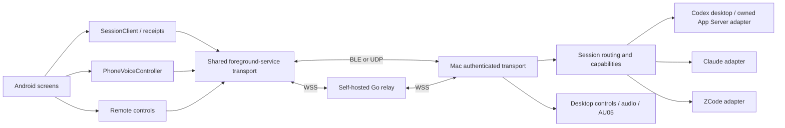

# Architecture / 项目架构

VibePier is a native Android companion, a macOS menu-bar app with an embedded runtime, and an optional self-hosted Go relay. Providers execute on the Mac; the phone presents their supported capabilities. There is no VibePier cloud account, web frontend or database service.

The [unified agent control implementation](AGENT-CONTROL-ARCHITECTURE.md) separates desktop-attached adapters from managed runtimes and implements a typed phone/Mac boundary in the development source. [统一 Agent 控制](AGENT-CONTROL-ARCHITECTURE.md)与[会话协议](../protocol/specs/agent-session.md)已接入双端；生产安装与各原生后端的真实验收独立进行。

All network application traffic uses the [authenticated control channel](../protocol/specs/secure-control.md). Relay authentication is an independent outer layer; the relay has no device keys. Direct UDP candidates are negotiated through an authorized connection. Phone audio uses BLE, local Wi-Fi or direct UDP and is not forwarded by the relay.

The signed handshake negotiates the application protocol and transport capabilities before accepting controls. Controls, configuration and session RPC are required; phone audio is optional. An incompatible authenticated peer receives a signed refusal and the phone displays an update notice. Per-device handshake quotas preserve capacity for other phones. Trust changes retire the affected transport sessions and release their keys/audio without waiting for the ordinary connection lease.

## Repository map

| Path | Responsibility |
| --- | --- |
| `apps/macos/Sources/VibeLocalization` | Embedded English/Chinese catalog and locale selection for hardware, runtime, app and CLI. |
| `apps/macos/Sources/VibeKit` | AU05 reports, cryptography, commands and USB-session scheduling. |
| `apps/macos/Sources/VibePierCore` | Runtime, security, transports, desktop providers and feature services. |
| `apps/macos/Sources/VibePierApp` | AppKit/SwiftUI app, menu, windows and observed UI models. |
| `apps/macos/Sources/vibepier` | Thin CLI entrypoint into the core command implementation. |
| `apps/android/app/src/main` | Native Android application and shared feature code. |
| `apps/android/app/src/designReview` | Synthetic UI fixtures and review-only resources. |
| `apps/android/app/src/production` | Disabled review entrypoints for debug/release builds. |
| `apps/android/test-fixtures/install-probe` | Build-only synthetic APK fixture bundled in the emulator instrumentation package, never in the production app. |
| `services/relay` | Go command, authenticated WebSocket framing and room routing. |
| `protocol` | Versioned wire contracts and shared test vectors. |
| `assets` | Editable branding and public documentation illustrations. |
| `scripts` | Explicit build, development, validation and release tooling. |
| `docs` | Product, implementation and operator documentation. |

## macOS ownership

`Daemon` owns the AU05 session, transport lifetime, held-key cleanup, heartbeat scheduling and runtime state. Its lock protects shared configuration and transient state; asynchronous callbacks retain their original device/session identity. `RuntimeCommands` routes local task/session/APK requests separately from that hardware state. The private local socket is accessible to the Mac user, not a remote API. `ControlSocketIO` owns bounded newline framing and nonblocking I/O under absolute deadlines. The server checks peer UID, admits at most 16 clients including running handlers, and keeps partial reads off the accept queue. `ControlSocketEndpoint` requires a private parent, holds a stable owner-only lock file, and removes only its own socket identity; a second start cannot unlink a live listener. Stopping interrupts client I/O without closing a descriptor another worker may still use. The listening descriptor closes in its [Dispatch cancellation handler](https://developer.apple.com/documentation/dispatch/dispatchsourceprotocol/setcancelhandler%28handler%3A%29).

`SessionFileAccess` preserves observed file-permission refusals and publishes fixed notifications without file paths or content. The file-access monitor retains only the last real read check in memory and bounds explicit rechecks; the app's permission page reports that operation's status, not a global Full Disk Access grant. The installed app can reopen repair guidance once after a refusal. Local update tooling preserves the app bundle directory and validates signing compatibility, while the LaunchAgent associates the app bundle with the background job. See [Mac updates and permission status](MACOS-UPDATES.md).

文件访问状态依据最近真实读取，拒绝通知不携带路径或正文；检查有界、不读取 TCC 数据库。更新保留应用目录并核验签名兼容，后台任务关联应用身份，详见 [Mac 更新与权限](MACOS-UPDATES.md)。

`Apply` implements compare-before-write firmware settings, `Replay` translates firmware bindings into host key events, and `RemoteControlOwners` prevents one phone from releasing another phone's held control. These services do not own UI windows. `ScreenLockController` owns manual/temporary unlock leases and accepts injected system actions for safe tests.

`KeySynth` validates the complete shortcut before emitting any native modifier, key or mouse event. `PhoneInputLease` persists a private recovery record before temporarily selecting the phone input, checks the selected input after each change, and preserves unreadable or unresolved recovery state instead of overwriting it with another gesture.

The Mac gateway lives in `Sources/VibePierCore/Gateway`: `SessionRemote.swift` owns authorization, routes, admission, the bounded reply outbox and the shared receipt journal, and `SessionRemote+AgentRequests.swift` binds the unified Agent Session API service to that journal. Services reached after admission live in `Sources/VibePierCore/Services`: `SessionRemote+ProviderServices.swift` (applications, account usage, screen lock and the provider adapters behind the session coordinator) and `SessionRemote+PhoneUpdates.swift` (Android update publishing and phone-requested installs). Mac 网关位于 `Gateway`（鉴权、路由、准入、回复暂存、回执日志与统一 Agent Session API 绑定），准入后的应用/账户/锁屏/服务商适配器与安卓更新服务位于 `Services`。

Security types own their storage and wire boundaries: `DeviceTrustStore` for approved phones, `RelayCredentialStore`/`RelayCredentialMigration` for relay credentials, and `SecureControlChannel` for authenticated sessions. Tests inject `SessionRemoteRouting`; they must not initialize real provider/Keychain singletons to test a transport. `SessionPacketInbox` owns Mac-side session assembly and packet replay accounting: an absolute 30-second assembly lifetime, four incomplete packets per device/eight total, and five-minute replay records capped at 2048 per device/8192 total without early eviction. It verifies frame types, the complete authenticated body and timestamp before returning the original bytes to the provider/journal. Stop and revocation discard partial work while retaining unexpired replay records.

`SessionWorkBudget` charges authenticated work until its completion is consumed: 16 requests/2 MiB per device and 64/8 MiB globally. The first provider callback claims a completion token; duplicate/stale callbacks cannot release or finish newer work. Password verification is globally exclusive. Frame admission has separate 4096-frame/4 MiB per-device and 8192-frame/16 MiB global limits; provider-event queuing is separately bounded. Disconnects do not free a slot for an action still running. Read reply bodies are capped at 2 MiB per device/8 MiB globally, with 128/512 entries; only completed reads are evicted. Outgoing packet replay caches keep at most eight packets per phone/24 total.

`SessionReceiptJournal` is shared security infrastructure, moved out of the Codex provider. It reserves completion space before a native mutation, retains unknown operations, and uses `ReceiptJournalFile` for bounded reads and atomic private-file replacement. A failed completion write produces an unknown reply; native success alone is not reported as durable success. Completed request intent is removed when completion is saved. Old completed bodies can be retired without deleting their operation IDs/fingerprints. The on-disk filename remains `codex-receipts.json` to preserve existing reservations across this internal rename. See [receipt retention](PRIVACY.md#mac-operation-receipts--mac-操作回执).

Providers are under `Providers/Codex`, `Providers/Claude`, `Providers/ZCode`; shared conversation activity, image and Markdown support live in `Providers/Shared`. Provider adapters report capabilities and retain mutation receipts. A missing/unsupported capability is a refusal, not permission to infer success or replay a request. `DesktopMutationScope` preserves uncertainty after the first native effect, including partial settings changes. Claude sends require a unique appended native user-message ID with the complete body; approval submission uses one verified click and a matching native answer record. An empty composer or a disappeared permission row is insufficient.

`DesktopInput` selects a single accessibility or hit-tested pointer action before submission. An accessibility error never triggers a second click. Pointer events and key press/release pairs are prepared before posting; a posted mouse-down always gets a mouse-up, including loss of focus, and cursor cleanup respects subsequent user movement. `DesktopClipboard` uses a bounded multi-type snapshot and an ownership marker/version: later clipboard changes are preserved. Native copy cleanup binds the observed version; it does not authenticate which application wrote the clipboard.

ZCode native confirmations use complete, bounded human-message text rather than display excerpts: creation checks the first eligible human message, sending checks the immediate next one after its original anchor. The pre-create ID baseline includes archived tasks and all projects (up to 100,000 IDs); ordering ambiguity, missing anchors, oversized text and moved old IDs cannot confirm success. Native receipt cache keys include the trusted client identity passed separately by the bridge.

`ProviderOperationReceipts` reserves a client/operation identity and canonical request fingerprint before Claude or ZCode mutations and Codex creation. It binds replies to the original operation kind, session, directory and approval fingerprint. Duplicate unresolved requests return unknown; conflicting reuse is rejected. Up to 20,000 identities/16 MiB are retained per provider instance, with 2,000/4 MiB per client. At capacity only completed response bodies may retire: identities and unresolved operations remain, and retired lookups remain unknown. Reconnect/unsubscribe does not discard these records. ZCode separately retains at most 128 unresolved native submission proofs/8 MiB and refuses new reservations instead of evicting one.

Late creation queries preserve the new native thread/directory/message metadata. Codex and Claude reserve observer memory before execution and arm the read-only observer only after submission succeeds. Codex reuses its original ID baseline and exact first native message; Claude checks the full first human message, session ID and directory in an 8 MiB native JSONL prefix. ZCode reuses its verified copied native ID and original first-message proof. Provider-local evidence is process-local; after restart a durable unknown reservation can remain unresolved and is never automatically resent. Approval reconciliation requires the actual submitted flag and original fingerprint, not a synthesized acknowledgment.

Claude headless processes share an admission budget across bridge instances: four live children per trusted phone and eight in total. Capacity is reserved before spawning and retained until the actual child exits, including after a creation receipt, disconnect or subscription close. A failed spawn releases its reservation; an over-capacity request starts no child. Prompt memory including inline images is also counted (8 MiB per phone / 16 MiB total).

`ClaudeProcessOutput` bounds each CLI JSONL line to 8 MiB, stderr to 4 KiB, and retained terminal diagnostics to 600 characters / 2,400 UTF-8 bytes. Oversized lines are drained without retaining the body. Only the terminal error flag and a bounded diagnostic survive parsing; a zero exit status without a complete, valid terminal result does not confirm successful completion. The parent closes unused pipe ends and allows up to two seconds for both output streams to reach EOF before detaching readers, preserving final output from a fast-exiting child. These checks report incomplete output without resubmitting the original operation.

`CodexBackgroundSessions` gives the default `codex.currentV1` adapter a background App Server path for phone-created threads. It uses the bundled CLI and existing native Codex home/account, creates only its own threads with originator `vibepier`, and persists their backend ownership in a private registry. Opening, sending, settings, approvals and interruption of registered threads stay on that backend after restart; ordinary desktop history is never adopted into it. Existing desktop threads retain versioned owner-bound IPC. Background availability follows the connection and verified native state rather than screen unlock, sending requires idle, and queue/steer/delete actions remain disabled. Model, effort, permission, execution-mode, speed and attachment inputs retain their original validation and receipt requirements; incomplete native evidence remains unknown.

默认 Codex 新建由 `CodexBackgroundSessions` 在后台 App Server 执行，沿用 Mac 已登录账号，无需解锁或桌面接管。自有 `vibepier` 会话的后端归属持久保存，重启后仍按登记路由；普通桌面已有会话继续走原 owner 的 IPC，不迁移到后台。后台发送必须空闲且连接可用，队列、引导与队列删除关闭。配置、首条消息及附件须分别取得原生证据，不能仅凭启动成功或 setter 回答宣称完成。

The retained legacy accessibility creation path uses its own serial worker and the shared desktop-interaction lock. `CodexCreationFlow` separates opening, composer preparation, one submission and receipt observation; `CodexNewComposer` binds Send to the focused window, editor and project. It is not an automatic fallback after an uncertain App Server action. The device-scoped durable SessionRemote journal prevents resubmission for both paths; read-only receipt observers cannot submit another action.

The Mac `L10n` layer lives in the dependency-only `VibeLocalization` target, with a checked-in JSON catalog and generated Swift dictionary. `VibeKit` and `VibePierCore` depend on it; the core keeps a public `L10n` type alias for app and CLI callers. It does not read a mutable translation file at runtime or require a sidecar bundle. Labels resolve the app/CLI locale; provider selectors and protocol identifiers stay unchanged. See [localization](LOCALIZATION.md) for generation and verification.

## Android ownership

`HomeViewport` measures the complete home controls at their natural height and scales the canvas uniformly to fit the available width and height (minimum unscaled width: 360 dp). When height limits the scale, the logical canvas width expands inversely to keep rows filling the window without side gutters. System-bar and cutout insets stay outside the canvas. Native child transforms preserve touch hit testing; the home has no vertical scroll container, while the app dock keeps horizontal scrolling.

首页由 `HomeViewport` 统一测量和等比缩放，空间不足时保持全部控件可见，同时扩大逻辑画布宽度，使缩放后的各行铺满窗口，避免额外左右留白；系统栏和刘海区域不参与缩放，触摸坐标随视图变换映射。首页移除纵向滚动，应用栏仍可横向滑动。

`MainActivity` composes the remote-control screen, permission prompts and settings. It attaches to `RemoteConnectionService` rather than owning a second transport. The service uses `ConnectionLifetime` to keep one `RemoteSender` across Activity recreation, and only stays alive after the user opens the app.

- `ConversationNavigation` owns the session overlay and document-picker lifecycle. Entering it releases input; the underlying controls are hidden from accessibility while the overlay is visible. A cancelled picker preserves the panel and draft.
- `PhoneVoiceController` owns the voice gesture's session ID, readiness timeout, retries and capture lifetime. It ignores stale ready/error/audio callbacks. Android permissions and capture APIs remain in the Activity adapter and `PhoneMicCapture`.
- `ConversationPanel` coordinates lists, page subscriptions, composer state and approvals. `ConversationMessageRenderer` creates message layout, `ConversationMedia` owns bounded image caching/decode/viewing, and `InlineReplyProcess` manages ordered lazy tool output.
- `ReplyPartGrouping` owns semantic boundaries and language-independent summaries. `ReplyPartLabels` localizes their display and `ReplyTextStyle` colors diffs inside the session feature; the unused older `ReplyParts` view has been removed.
- `AppUsageMath` and snapshots retain raw quantities/category IDs; `AppUsageLabels` resolves display strings. The cache exposes a source-scoped snapshot rather than preformatted text.
- `SessionClient` owns encrypted session RPC, durable uncertain receipts (including `new` for every provider), provider-scoped drafts and bounded cached content. An uncertain creation retains the original prompt and operation ID across dialog/client recreation. Receipt lookup only observes; a `notFound` reply enables an explicit retry of the saved request. Views do not directly read provider files or grant themselves capability from a cache.
- `SessionResponseInbox` validates Mac reply frame identity/types, bounded Base64/UTF-8/JSON and actual boolean fields before delivering content. Eight assemblies have absolute 45-second deadlines; duplicate chunks cannot replace bytes or extend them. Timer tickets belong to one assembly generation. Replay records last five minutes with a 4096-entry cap and no early eviction. Mutable replies must confirm the original provider/session/effect before clearing durable uncertainty or a draft; late creation replies retain the new native session ID.
- `SessionClient` admits at most 64 active requests/2 MiB, 16 callbacks per coalesced request, and 128 durable uncertain requests/8 MiB. Oversized/conflicting/full-capacity submissions fail before transmission; old uncertain requests are retained. Incoming main-thread work is bounded to 2048 copied frames. Timeout callbacks retain the original request identity, and a closed client cannot enqueue new work. Password validation is not retried or persisted as a pending phone receipt.
- `PrivatePreferences` authenticates private cache values and entry names, wrapping store keys with Android Keystore. `RelaySettingsStore` owns encrypted relay setup; `DeviceKeys` owns the stable device identity and Keystore control keys.
- `RelayWriteQueue` bounds pending encrypted writes; each write retains its original output stream identity. `TransportLog` accepts fixed event/error categories so parser exceptions cannot copy private network content into diagnostics.

Attachment uploads use background encoding/encryption, a negotiated three-chunk window and authenticated direct Wi-Fi routing; capability 16 avoids encrypting already encrypted fragments twice. Mac completion synchronizes once after full coverage and SHA-256 validation; see [attachment transfer](ATTACHMENT-TRANSFER.md).

Page/attachment callbacks carry generation and scope. Hiding a page cancels pending reads before cleanup can create a new request; late decoded images cannot update another conversation. Backgrounding releases keys and recording but keeps the shared connection. Review builds stay isolated unless the explicit encrypted-loopback lifecycle probe enables the connection service.
Android conversation history keeps the first visible message and its pixel offset when earlier messages are inserted, excluding the pagination hint from anchors. Restoration runs after layout, before drawing; multiple snapshots in one frame share the original anchor, and restoration cannot trigger another history request. Earlier reply-part expansion captures the current viewport when the response arrives rather than when the request starts.

## Storage and configuration

Mac support data is in the current user's `Library/Application Support/vibepier`; device/relay credentials live in Keychain. The optional unlock password is user-selected local preferences in `preferences/unlock.json` (plain text, `0600`, account-bound), excluded from portable settings. Legacy unlock credentials migrate only after an atomic preferences commit; an empty record prevents cleared credentials from returning. A confirmed unlocked screen clears the prior unlock failure gate; a still-locked failed attempt never retries automatically. Android secrets use Keystore and sensitive preferences use authenticated encryption. The relay stores only its deployment secret and transient in-memory routing state. See [privacy](PRIVACY.md) for exceptions, metadata and backup behavior.

[Portable settings](SETTINGS-TRANSFER.md) use an explicit versioned allowlist, rather than copying raw configuration directories. Device identity, credentials, arbitrary scripts, project paths and session content never become part of that export.

## Boundaries to preserve

Do not share one mutable reply route between phones, emit application metadata before authorization, or accept unencrypted compatibility controls. Do not use a UI refresh to reinstall a transport, replay an ambiguous mutation with a new ID, retain microphone capture after a gesture, or make a build command install/launch an app.

There is no component registry, Cloudflare dependency or hosted backend. Mac GUI SwiftPM product `VibePierApp` is intentionally distinct from CLI product `vibepier`, because case-insensitive build paths cannot safely contain products differing only by case.

## 中文导读

目录按平台和功能划分，运行逻辑、界面、协议与部署素材各有归属。Mac 的 `Daemon` 保留设备和连接生命周期，命令路由、固件设置和按键回放已拆为独立模块。手机 Activity 负责组装和权限，导航、语音会话、消息布局与图片缓存分别由独立类管理。

重构时优先守住已有边界：一个后台连接实例、按设备隔离控制、离开页面取消读取、松手停止录音、不确定发送保持原操作 ID。安全存储与协议测试使用临时数据，不连接真实用户会话。交付要求以 [TODO](../TODO.md) 为准。

握手签名包含协议版本和功能位，不兼容时显示更新提示；手机音频是可选能力。按设备限制握手容量，撤销或更换密钥只清理对应设备的连接、按键和音频。握手格式升级需要同时更新 Mac 与手机，不兼容此前的开发版本。

本地控制 socket 校验同一用户身份，最多容纳 16 个连接（包含正在执行的请求），读写有总期限和大小上限。接收慢速数据不会阻塞其他连接；启动失败或停止时不会误删其他文件或已有监听实例。手机会话分片由独立接收器管理，每台最多 4 个未完成包、全局 8 个，重复分片不会延长 30 秒期限；停止和撤销授权时保留尚未过期的重放记录。

手机回复分片最多同时接收 8 包，每包固定 45 秒期限，重复内容不续期也不覆盖。布尔字段必须是真正的布尔值，成功回执须匹配原服务商、会话与操作结果；不匹配时保留未知回执和草稿。待处理请求、合并回调与持久未知回执均有数量/字节限制；密码验证超时不自动重试，也不存入手机待处理回执。

Mac 异步工作按设备和总量限制，直到回调被处理才释放配额；同一任务只接收第一次完成回调。断线不会让仍在执行的操作失去计数，密码验证不会并发执行。所有服务商共享 `SessionReceiptJournal`，写入结果失败时仍返回未知状态；过期回执可移除正文，但操作编号与指纹继续阻止重复执行。

`CodexUsage` runs account-only queries on a separate serial queue via bounded, short-lived stdio app-server connections (`CodexAccountRPC`). Only initialization, rate-limit reads and explicit reset-card redemption are permitted; the process never starts a thread. The Mac and encrypted phone journals retain uncertain redemption IDs. Replies bind account ID, selected card ID and native outcome. `CodexMessageIdentity` derives an opaque UUID from the authenticated phone, native thread and operation; sending, durable queues and native receipt lookup use that same identity. Workspace attachments are read through the descriptor-based workspace boundary and copied to private managed storage at selection time, preventing a later workspace path replacement from changing the submitted file.

### File previews and application selection

`ConversationImageLoader` moves validated image references off all provider queues. Two workers are shared across providers; each RPC has a six-second deadline. A timed-out native file open retains its worker slot until it actually exits, while its callback is delivered once. This prevents file-permission waits from filling the session request queue. Native Documents/Desktop/Downloads access still requires the Mac user’s OS authorization.

The phone’s `ApplicationPickerPage` requests a bounded installed-app catalog and updates dock slots over the authenticated session channel. `SessionRemote` maps only `applications` and `applicationShortcutSet` to dedicated local runtime commands. `ApplicationCatalog` returns app names/identifiers, never paths, and validates installed IDs, slot bounds and the configuration revision before saving. Repeated identical requests are harmless; stale conflicting edits require refresh. Selection does not launch or unlock an application.

Session replies and WebSocket text use `StrictUtf8`: decode once with the platform UTF-8 string constructor, then require byte-for-byte re-encoding before parsing. Invalid, overlong or truncated sequences remain rejected. Large ASCII/Unicode, embedded NUL and literal replacement-character fixtures cover the boundary independently of JSON parsing.

### Request isolation / 请求隔离

Authenticated RPC capacity is partitioned on the Mac by a fixed operation/provider mapping. Codex, Claude and ZCode each receive 3 requests/384 KiB per phone (12 requests/1.5 MiB globally). Account operations receive 2/256 KiB and controls 1/128 KiB per phone. Each provider and the account service reserve one separate receipt lookup/128 KiB per phone. Global lane limits are four times the per-phone limits; their sum remains 16 requests/2 MiB per phone and 64/8 MiB globally. Callers cannot select a priority lane. A blocked provider cannot consume another provider's or receipt lane's capacity. Running work stays charged until its actual completion; disconnecting or retrying cannot manufacture more capacity.

Directory browsing and Markdown reads use `SessionFileLoader` after selected-view/reference validation, separate from provider serial queues. Two workers share a six-second reply deadline. Timeout returns once and releases the RPC while retaining the actual blocked filesystem worker slot; excess reads fail promptly. Snapshot cache locking never surrounds filesystem access, and closing a device invalidates older prepared reads. OS folder permission is still required. Claude desktop sends retain their original native-message baseline for read-only late receipt reconciliation; checking a receipt never sends again.

Mac 按固定服务商/操作类型分配请求额度，并为各服务商的回执查询单独保留名额，总并发和内存上限保持不变。文件浏览、Markdown 读取先验证会话与路径权限，再移到独立的 2 个工作线程；6 秒超时只回复一次，阻塞线程仍占自己的名额，防止反复重试堆积线程。单个服务商卡住不会挤占其他服务商或回执额度；原生目录授权仍须在 Mac 完成。Claude 发送保留原生消息基线，迟到回执通过只读核对恢复，不自动重发。

`SessionRequestAdmission` also bounds each provider's serial queue to 16 retained requests. Work waiting more than six seconds is rejected before execution; an expired send cannot run after the queue recovers. Expired queued entries remain charged inside admission until consumed, so repeated retries cannot accumulate closures behind a stuck operation. A running queue block is marked stalled after 30 seconds and rejects further admissions until it exits; its original result and RPC charge remain intact. Cached mutation replays and final process-local receipts bypass the provider queue without invoking native observers; a replay of a running send stays unknown instead of being misclassified as a rejected fresh request. Desktop focus/clipboard lock acquisition is bounded to two seconds across providers, with recursive acquisition preserved for nested helpers.

服务商队列最多保留 16 个请求：排队超过 6 秒的请求明确取消，恢复后不会补执行；过期占位在队列实际处理前保留，避免反复重试堆积内存。正在执行的队列任务超过 30 秒后暂停接收新请求，实际结束后恢复；不把发送超时伪装成失败，也不释放仍在执行的资源。已确认的回执直接读取缓存，不等慢操作。跨应用桌面锁最多等待 2 秒。故障服务商仍可能暂时不可用，这些保护限制故障影响范围，不代替恢复原生应用或授权系统目录。

### New-session configuration / 新会话配置

`SessionCreationDraft` binds the first text, model, reasoning effort and approval mode to a provider/project and a draft UUID. Android stores it in encrypted preferences, debounces edits, flushes on dismissal, and freezes the original request while its outcome is unknown. Uploads use `newAttachmentStart/Chunk/Complete/Remove` with a trusted-device/provider/project/draft scope, never a fabricated native thread ID. A confirmed late creation receipt clears only matching text/configuration and the attachments actually submitted; newer edits or added attachments survive. Closing the composer cancels outstanding option reads so they cannot retry desktop preparation later.

Codex configured creation starts and records an owned native thread in the background App Server, validates settings and empty history, then submits the configured first turn once without desktop takeover. Its ownership registry survives restart; unresolved submissions continue through the original receipt path. The bundled **0.160.0** CLI's stable and experimental schemas are checked for this path independently from desktop IPC and the optional isolated runtime. Claude validates and persists configuration before starting the CLI, uses a bounded streaming user message for images, and requires exact native first-message text/image proof. ZCode reads native model/mode/effort menus for a trusted phone/project/draft, validates choices before applying them, and rechecks the empty native draft before one first-message submission. ZCode creation attachments remain unsupported. Isolated contract tests and actual native creation acceptance remain separate.

新会话草稿按服务商、项目和草稿 UUID 隔离，附件上传不借用虚构的原生会话 ID。未知结果始终保留原始请求；迟到成功回执只清理已提交内容，不清掉后续编辑或新加附件。首次模型、推理和审批配置必须在提交前绑定。三个服务商的创建配置均已有实现及隔离测试，ZCode 新建附件仍不支持；真实原生创建验收仍待完成，不能以模拟证据代替。

任务完成检测通过既有授权加密会话通道向手机发送去重事件；Android 会话客户端由连接持有，Activity 销毁不影响前台服务接收通知。协议、权限与离线边界见 [任务完成通知](TASK-NOTIFICATIONS.md)。

Android version reports and registered update artifacts are managed by `PhoneAppVersions` on the authenticated SessionRemote queue; see [Android updates](ANDROID-UPDATES.md). 手机版本按设备保存，可用 APK 通过独立本地操作登记。

APK relay transfer profiles are negotiated by `PhoneAPK` per authorized device, transfer and relay peer. `SessionRemote` emits large frames only for the corresponding APK request; the existing secure-control size limits remain unchanged. Android's `SessionResponseInbox` admits them only against a live request on the negotiated connection. `ApkDownloadWindow` reserves four slots across network/buffer/disk work, and `ApkDownloadGuard` serializes cancellation with contiguous synced writes. Mac progress uses the explicit durable offset. See the [APK wire contract](../protocol/README.md).

APK 并发下发独立于普通会话消息：四块窗口包含在途、缓冲及写盘数据；授权、重放保护、设备隔离、摘要验证及系统安装回执均保留。

### Build 11 ownership / 本轮职责

`ClaudeHistoryIndex` streams metadata into a private disposable SQLite index and reads selected turn ranges from the original JSONL. The shared serialized-body cache is 4 MiB, single pages are at most 8 MiB, and active indexes/summary entries have explicit count limits. Original old messages and image identities remain queryable; oversized turns fail explicitly. `ClaudeTranscript` owns projection, not storage. Late native-send evidence is independent of body cache eviction.

`ConversationViewState`, `ConversationActions`, `ConversationTimeline` and `ConversationTimelineContent` separate Android route identity, action semantics and view reconciliation. Pending picker state binds a durable authorization epoch/provider/thread; verified-page readiness gates adding restored attachments. `ZCodeDesktopCache` owns bounded native settings/cache retention.

`APKPreparationWorkers` separates two filesystem workers from SessionRemote routing. Per-phone preparation reservations bind the original key and artifact digest; async snapshots expose typed phases to Mac UI. The phone can request only its authorized Mac's registered newer artifact using `androidUpdateStage`. Relay output uses one 12 MiB aggregate budget including in-flight writes; fixed close categories never record room/endpoint/payload.

Claude 历史只索引元数据并按轮读取，正文共享有界缓存，不保留整段投影；旧正文与原生回执证据留在完整 JSONL。Android 导航、动作和消息重用分别有明确归属，附件恢复绑定持久授权身份和原会话。Mac APK 文件处理独立于会话队列，完成前重新验证原钥与版本，异步快照用类型化阶段驱动界面。中继跨房间共享发送额度，计入正在写出数据。

`BinaryFileTransfers` issues scoped file capabilities through a private pipe to the bundled `VibePierFileServer`. Android `BinaryFileClient` uses pinned direct HTTPS or the authenticated relay file stream; both attachment and APK bodies rely on HTTPS and authenticated expected digests. See [binary file transport](BINARY-FILE-TRANSFER.md).

### Mac permission guidance / Mac 权限引导

`MacPermissionsGuide` lives in the GUI Access feature. Only an app launched directly from `/Applications` automatically presents setup once; a local UserDefaults version records presentation, never permission. Build, packaging, CLI and tests do not open System Settings. The guide uses public NSWorkspace navigation and never reads or edits TCC state. Full Disk Access does not widen session file allowlists or phone authorization.

权限引导属于 GUI 的 Access 功能；仅 `/Applications` 安装版首次启动自动显示，UserDefaults 只记录展示版本，不记录授权。构建、打包、CLI 和测试不打开系统设置，不读写 TCC；完全磁盘访问不改变会话文件白名单和手机授权。

Conversation/project images and MP4 previews use the raw HTTPS binary file channel shared with uploads and APKs; see [binary file transfers](BINARY-FILE-TRANSFER.md). LAN/public IPv6 candidates and relay are probed concurrently; automatic IPv4 NAT traversal is unsupported.

媒体下载与上传/APK共用二进制文件助手；元数据仍经授权控制通道，正文不作应用层加密或Base64分块。公网IPv6候选与局域网/中继并行探测，IPv4 NAT打洞尚未实现。

### Phone assistant visibility / 手机助手可见范围

Mac-owned `SessionProviderPolicy` persists provider flags and a monotonic revision in Config. SessionRemote synchronizes it on the authenticated channel, rejects fresh disabled-provider operations and suppresses late read/push content while retaining durable receipt queries. Android filters provider tabs, notifications and cached navigation by that policy; all-off has an explicit empty state. Running desktop tasks and drafts are retained. See [provider visibility](PROVIDER-VISIBILITY.md).

Mac 菜单开关只决定授权手机的服务商可见范围；保存成功后加密同步、关闭后拒绝新操作，未知回执和桌面任务保留。

Codex background reconnection preserves a registered live server across desktop app replacement. If macOS reports the old executable path as ENOENT, reuse additionally requires the original UID/PID/birth, unchanged private socket identity and kernel-reported peer UID/PID, with identity rechecked after connecting. Other path errors, a changed executable path, replaced sockets and reused PIDs remain rejected. Creation errors remain visible through option refreshes; the phone explains background creation without a foreground requirement.

Codex 桌面升级替换可执行文件后，后台重连仅在路径报告 ENOENT 且原 UID/PID/启动身份、私有套接字身份与内核对端 UID/PID 全部一致时复用旧进程，连接后再次核对；其他路径错误、路径改变、套接字替换或 PID 复用仍拒绝。新建失败原因不会被选项刷新覆盖，手机明确提示后台创建无需切到前台。
