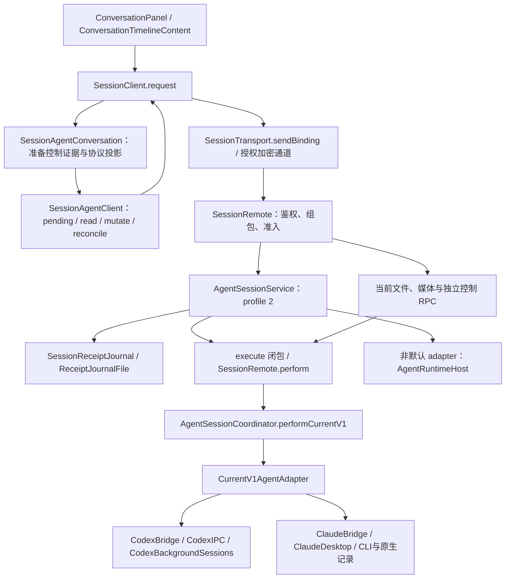
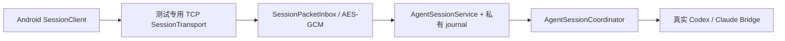

# 会话调用链与测试接缝

本文描述 Codex、Claude Code 的当前源码调用链与测试边界，不代表已安装二进制或验收结果。结果以 `.local/agent-session-qa/VALIDATION.md` 及其引用证据为准，配套执行清单见 [双 Agent 测试计划](AGENT-SESSION-TEST-PLAN.md)。已实现接缝与后续提取建议分别标明；源码中存在接缝不等于相关用例通过。

## 当前调用链

下列目录简写用于定位源码：

- Android：`apps/android/app/src/main/java/io/github/junweiup/vibepier/remote/`。
- Mac：`apps/macos/Sources/VibePierCore/`。
- Android 单测和探针分别在 `apps/android/app/src/test/java/io/github/junweiup/vibepier/remote/`、`apps/android/app/src/androidTest/java/io/github/junweiup/vibepier/remote/`。
- Mac 单测在 `apps/macos/Tests/VibePierCoreTests/`。

会话业务仅使用 profile 2；文件、媒体和独立控制 RPC 继续使用当前授权封装。图中还包括显式配置的可选后端，不是每个请求都顺序经过所有框。`SessionRemote+AgentRequests.makeAgentService()` 将 service 的异步 journal 接口绑定到共享日志，并在 execute 闭包再次检查可信设备、provider 策略。默认 adapter 经 `SessionRemote+ProviderServices.perform` → coordinator；非默认 adapter 经 runtimeHost。v1 能力由 coordinator 颁发，profile 2 的 sessionRef、epoch、revision、lease 由 service 管理，二者不能合并成一个“版本号”。

### Android：UI、控制准备与持久回执

[`ConversationPanel.kt`](../apps/android/app/src/main/java/io/github/junweiup/vibepier/remote/features/sessions/ConversationPanel.kt) 的 `call` 在正常模式调用 `SessionClient.request`；review 模式走 `ConversationReviewFixtures.reply`，不能据此证明 Mac 或原生 Agent 工作正常。

[`SessionClient.kt`](../apps/android/app/src/main/java/io/github/junweiup/vibepier/remote/core/session/SessionClient.kt) 同时承担授权状态、provider/adapter 选择、加密传输、超时和页面投影。会话业务必须由 `agentConversation.request` 转为 profile 2；未协商或无法路由时明确拒绝，不能落回旧业务 RPC。旧会话 pending 不读取为当前意图，也不能重发；当前独立控制的账本保持分离。保存的 session descriptor 只能恢复读取身份，不恢复写 lease。

[`SessionAgentConversation.kt`](../apps/android/app/src/main/java/io/github/junweiup/vibepier/remote/core/session/SessionAgentConversation.kt) 是实际协议投影层，不存在独立名为 `AgentClient` 的 UI 门面。映射包括：

| UI 操作 | profile 2 方法 | 前置身份/证据 |
| --- | --- | --- |
| projects / list | workspace.list / session.list（以 Method.wire 为准） | 已选 adapter，工作区引用 |
| newOptions / new | session.creationOptions / session.create | workspaceRef、draftId、optionsRevision、创建 lease |
| open / sync | session.open / session.snapshot | sessionRef；完整快照才能建立控制证据 |
| send / settings | message.submit / session.configure | ownershipEpoch、capabilityRevision、controlLease |
| approve | approval.resolve 或 question.answer | 原审批 ID、fingerprint、revision、允许的决定/答案 |
| receipt | operation.get | 原 operationId；不重新执行变更 |

具体 wire 名称见 [`SessionAgentProtocol.kt`](../apps/android/app/src/main/java/io/github/junweiup/vibepier/remote/core/session/SessionAgentProtocol.kt)。`prepareSessionControl` 在首次变更前只读刷新 snapshot，以注入的时钟、调度器做有界准备；刷新期间核验 identity/provider/adapter/view/ref 和控制 generation。创建准备另有 draft/options 作用域。它保留原始操作对象，审批内容变化不能借刷新自动批准新请求。

[`SessionAgentClient.kt`](../apps/android/app/src/main/java/io/github/junweiup/vibepier/remote/core/session/SessionAgentClient.kt) 的 `mutate` 先保存原请求再发送；保存失败不发送。`settle` 仅在 confirmed/rejected 且本地完成处理和删除成功后结算，否则保持 unknown。`reconcile` 只读 operation.get；`late` 校验原请求后结算。`resend` 是显式入口，复用原 operationId 和原 body，仅更换 requestId；UI 应在 notFound 后才允许用户重试，不能把这个入口描述成自动重发或所有 unknown 都可重试。

### 审批“点击无响应”的实际分界

1. [`ConversationTimelineContent.rows/approvalView`](../apps/android/app/src/main/java/io/github/junweiup/vibepier/remote/features/sessions/ConversationTimelineContent.kt) 捕获渲染作用域，点击时要求 `activeView()` 且当前 scope 相同。卡片 key 为 approval ID 与 fingerprint。需测试同卡片复用后 closure 是否仍代表当前页面；目前仅从源码识别风险，尚未证实为缺陷。
2. `ConversationPanel.showApproval` 遇 `detailsOnDemand` 先读取完整详情，并核对 generation、fingerprint 和当前 approvals。旧详情回调不能打开新页面的弹窗。
3. 弹窗 `current()` 检查 renderingScope、foreground、drawer、generation、thread 和 dialog 实例。`update()` 将 mutableReady、approvals 能力、滚动到底、submittingApproval、approvedHere、unknown 转成可操作状态；缺控制证据时会尝试一次 resync/requestOpen。`refreshApprovalActions` 已由 `updateComposer` 调用，并在弹窗关闭时清理；原因文案与刷新逻辑均已实现，实际状态变化仍需 API 37 点击证据。只读 options 审批不能仅因选项可见而启用决定按钮（D09）。
4. 二选一审批中 allow 受全文阅读限制，deny 有独立启用条件；unknown 时 deny 的位置变成“检查结果/重试原选择”，不是新的拒绝。`ConversationActions.approvalReceiptEnabled` 已将只读检查与重试原选择分开：连接且已授权、无在途请求即可检查；仅重试要求 canDecide（D07）。问题回答、选项按钮和 allow/deny 不能共用未经区分的测试断言。
5. 提交将 fingerprint 与 expectedApprovalRevision 交给 client；profile 2 投影检查原审批与刷新后的 revision，再传 approvalId/questionId。Mac 仍独立校验 lease、ID、fingerprint、revision 和 canDecide。
6. UI 的 accepted 需要 `ok && submitted`；关闭卡片、显示提交文案、网络发送完成都不足以证明原生决定落地。

### Mac：准入、证据和原生动作

[`AgentSessionService.swift`](../apps/macos/Sources/VibePierCore/Sessions/AgentSessionService.swift) 的 `mutate/prepareMutation/translate/finishMutation/proof/operation` 是需要分别测试的接缝：先按可信 client + operationId 查日志；重复、冲突、unknown 不进入新执行；新操作验证控制并 reserve，再执行 adapter。`finishMutation` 校验证据并保存，完成写失败返回 unknown。`operation` 对未决原 intent 路由 receiptCheck/newReceiptCheck/settingsReceiptCheck 等只读核对，而非原变更。

`translate` 将产品协议变成现有 provider 请求；`proof` 验证原生确认，配置要求有效 composer 字段回读，审批要求 submitted 和原 fingerprint。`AgentSessionDirectory` 保存公开引用与 native identity 映射，`AgentObservationStream` 负责观察序列；读取快照、事件内容更新、写权限失效是不同状态。

[`AgentSessionCoordinator.swift`](../apps/macos/Sources/VibePierCore/Sessions/AgentSessionCoordinator.swift) 选择 adapter、按 client/provider/creation 颁发能力、保护 thread/view/draft 作用域。`CurrentV1AgentAdapter.production()` 创建 CodexBridge、ClaudeBridge，闭包保留各 Bridge 的队列、进程和回执责任。adapter 协议现在仍是 `Data` 和异步 completion，并非已经全面类型化的领域接口。

[`SessionReceiptJournal.swift`](../apps/macos/Sources/VibePierCore/Security/SessionReceiptJournal.swift) 是设备级持久操作账本，底层文件是 `ReceiptJournalFile`；provider 侧 `ProviderOperationReceipts` 用于自身原生执行与观察身份。两层日志不是两次发送许可。重启后 provider 内存证据可能丢失，持久 unknown 不因此变成 notFound 或可自动重发。

### 两个默认 provider 的真实路径

| 场景 | 当前执行路径 | 验收边界 |
| --- | --- | --- |
| Codex 新建 | `CodexBridge.createConfigured` → `CodexConfiguredCreation.Services` → `CodexBackgroundSessions.startForDesktop` 创建空线程并 thread/unsubscribe → 打开原生线程 → awaitDesktopView → owner 绑定的 `thread-follower-start-turn` v2 | 首条需原生 thread/turn 身份；不能把空线程创建或打开窗口当作已发送 |
| Codex 旧线程 | `CodexBridge.handle`；旧后台登记线程空闲时尝试 releaseToDesktop，仍运行的后台线程保留其路径；桌面线程经 CodexIPC | 迁移不是所有线程无条件立即发生；禁止在不确定后切换路径补发 |
| Codex 审批 | 从当前 state 找 fingerprint 与原 request；通过对应 owner 的版本化 IPC 回答权限/文件/执行审批或问题 | 成功 IPC 返回须匹配受校验接口；真实验证还应核对原生审批状态及只执行一次 |
| Claude 新建 | `ClaudeBridge.create/launch` 以 CLI 首轮建立 session；进程结束后的回调尝试 `ClaudeDesktop.adopt` | adopt 在源码中为尽力尝试，创建确认不能证明已导入桌面；首轮并非全程桌面实时显示 |
| Claude 后续发送 | `ClaudeBridge.handle` → `deliverDesktop`；无桌面 owner 时尝试 adopt | transcript 中完整新用户消息的唯一 native ID 才是提交证据；输入框清空不算 |
| Claude 审批 | `ClaudeBridge.approve` 核对 desktop owner、fingerprint、requestId 和同 host 唯一 pending → `ClaudeDesktop.answerPermission/answerQuestion` → `permissions.waitAnswered` | 一次原生动作与相符答案；多卡片不猜目标，不因卡片消失判成功 |

源码依据：[CodexBridge](../apps/macos/Sources/VibePierCore/Providers/Codex/CodexBridge.swift)、[CodexBackgroundSessions](../apps/macos/Sources/VibePierCore/Providers/Codex/CodexBackgroundSessions.swift)、[ClaudeBridge](../apps/macos/Sources/VibePierCore/Providers/Claude/ClaudeBridge.swift)。

## 设计与实际差异

- [既有总体架构](ARCHITECTURE.md) 与 [统一 Agent 设计](AGENT-CONTROL-ARCHITECTURE.md) 中“默认 Codex 新建全程后台”的部分描述，以及 CodexBridge 的旧注释，与当前 startForDesktop 调用不一致。判断实际行为须沿当前调用链核对。
- “所有会话在桌面实时显示”是验收目标。Codex 已有桌面首条路径；Claude CLI 首轮及尽力 adopt 仍是明确差距，应记录实际结果，不把目标写成已交付保证。
- 可选 managed runtime/Mods 的设计和原型不等于默认 currentV1 行为；本轮矩阵只覆盖实际选中的默认 Codex/Claude adapter。描述符存在不能替代原生版本和动作验收。
- API 37 是本轮运行设备范围，`build.gradle.kts` 当前 minSdk 33、compileSdk/targetSdk 35；不为本轮计划擅自改变构建 SDK。

## 已实现的注入接缝与后续提取建议

| 状态 | 接缝 / 建议 | 验证与约束 |
| --- | --- | --- |
| 已实现 | `SessionAgentClient(identity, send, storage, adapterAllowed, selectedAdapter)` 可注入内存 Storage、捕获 send 和迟到 completion | 保存失败零发送、重复回执只结算一次；不引入 Android UI 依赖 |
| 已实现 | `SessionAgentClient.ReadScope` 关联逻辑读取与实际请求；`shouldCancelSessionPageRead` 保护 preserved 读取 | 真实 SessionClient pending/cancel、创建 options 与 workspace 分页一起回归；mutation/receipt 不随 UI scope 取消 |
| 已实现 | `ConversationPanel` 的审批刷新与 `recoverCreationOptions` 生命周期回调，`ConversationActions.approvalReceiptEnabled` 权限判定 | 关闭释放回调；新建前后台恢复仅重读 options；回执检查不依赖写权限，重试仍要求可决定 |
| 已实现 | `SessionAgentConversation` 的 scheduleRead/readClock 注入 | 按序交付 snapshot、dirty、旧回调；首次写前可刷新，unknown 后只读查询；保留原 fingerprint/revision |
| 已实现 | `AgentSessionService.Journal/Execute/Describe/FreshGate/now` 与临时 directory | 可阻塞回调、推进时钟、注入 journal 写失败；每阶段核对 native 次数、日志与状态，不实例化生产单例 |
| 已实现 | `ClaudeBridge.submitApproval` 的一次原生动作和答案读取注入；`CodexConfiguredCreation.Services` 闭包 | 已有有界只读 observer；动作后无答案保持 unknown，迟到确认匹配原请求；真实 AX 独立取证，禁止补点或跨 driver fallback |
| 后续建议 | 从 `ConversationPanel.showApproval` 的 update/current 分离纯 `ApprovalPresentationState`（建议名） | 先明确 allow/deny/options/questions 真值表；保留阅读门禁与 unknown 核对的差异，不改变协议或日志 |
| 后续建议 | 将 UI 详情读取、提交、核对包装为更小的审批动作接口 | 保留 Panel 调用关系；既有 ApprovalActionsProbe 的触摸接缝可继续复用，纯 reducer 不能替代点击和 scope 验证 |
| 后续建议 | 单独提取 service 的审批请求校验与 native proof 为纯函数 | 保持现有 fixtures 输出和 reserve/complete 次序，不同时修改 lease 与事件模型 |

已有覆盖锚点包括 `AgentSessionServiceTests.testApprovalRequiresIssuedIDFingerprintRevisionAndOnceScope`、`testWrongNativeIdentityAndPersistenceFailureRemainUnknown`、`testLeaseCannotBeBorrowedByAnotherPhoneOrUsedAfterExpiry`；Android 的 `newerApprovalComposerOrQueueContentCannotAuthorizeTheEarlierClick`、`originalUnknownOperationOnlyQueriesReceiptWithoutAnotherPreparationOrSubmission`。这些是存在的测试源码，不能仅凭本文称为本轮通过；实际运行状态须查验证报告。

测试日志只需合成 case ID、阶段、结果码、调用计数；生产诊断不输出正文、附件、密钥或完整授权令牌。需要跨端关联的真实 ID 仅保存于受限证据文件，对外报告用别名。先定位失败在哪个边界，再做一项提取，不通过“大服务重写”同时改变 transport、provider 和回执语义。

## API 37 执行接缝

[`android-session-qa.py`](../scripts/check/android-session-qa.py) 是当前本地入口，使用显式 emulator serial、已构建的 review APK 和测试 APK，语言限定 `en,zh-CN`；默认 12 项（含 `session-cancellation`），双语共 24 个计划实例，`agent-open` 可显式选入。主模拟器已有授权及 Keystore 必须保留，不使用清数据参数；真实 native 操作未决时沿原身份核对，不通过通用入口重新安装。其 manifest/API/runner 预检与逐项证据输出不替代 native 证据。执行结果集中引用 `.local/agent-session-qa/VALIDATION.md`，不在本文复制未核实的通过数。

[`ApprovalActionsProbe.kt`](../apps/android/app/src/androidTest/java/io/github/junweiup/vibepier/remote/ApprovalActionsProbe.kt) 已提供 `approval-actions`：通过真实 MotionEvent DOWN/UP 注入决定按钮，验证 Codex/Claude 的 allow/deny、能力恢复/丢失、提交中防重复及确认关闭；页面辅助导航仍有 performClick，native 结果为合成。因此它补齐的是 L2 触摸与弹窗刷新接缝，不能证明真实 native 审批、迟到观察或 UDP/WSS 授权链。API 37 的其他异常用例仍需按测试计划独立取证。

## 专项回归与当前接缝

用例详见测试计划 D01–D09。下表区分当前实现与待验证断言，不在本文登记结果或通过数。

| 用例 | 已实现接缝 | 回归边界 |
| --- | --- | --- |
| D01 审批弹窗刷新 | `ConversationPanel.showApproval/applyPage/updateComposer` 与 `refreshApprovalActions` | 弹窗存活期间启用/禁用双向变化；关闭清理；不调用旧 dialog 或重新提交 |
| D02 页面读取取消 | `SessionClient.cancelPageReads/preservedAgentReads` 与 `shouldCancelSessionPageRead` | preserved 保护覆盖两个协议分支；前后台切换和 held callback 不吞发送准备，完成最多一次 |
| D03 创建选项取消 | `SessionAgentClient.ReadScope` 关联逻辑 ID、workspace 分页与 v2 wire requestId | 取消真实读取且不再派生 options；不动 mutation/receipt；SessionCancellationProbe 的 120 次加密刷新/取消循环检查 pending 与定时器不积压 |
| D04 Claude 同名 tool 配对 | `ClaudePermissions.approvals/unresolved` 的唯一 candidates 与同名 pending 检查 | 一条 pending 对两条同名 tool_use 也须拒绝模糊关联，不按 transcript 顺序 first 猜测 |
| D05 Claude 迟到审批观察 | `ClaudeBridge.submitApproval`、provider receipt 与 `AgentSessionService.operation` | 单次动作后激活有界只读 observer，绑定原身份/请求/决定；迟到匹配可确认，错配、重复及重启丢证据不触发新点击 |
| D06 新建选项前后台恢复 | `ConversationPanel.recoverCreationOptions` / `loadCreationOptions` | 同 scope、无未决创建且非 busy 时恢复只读 options；保留 draft，旧回调不覆盖；关闭清理，不重发 create |
| D07 只读审批回执 | `ConversationActions.approvalReceiptEnabled` 与弹窗检查入口 | connected、authorized、非 inFlight 时不要求 canDecide 即可查原回执；显式重试原选择才要求写能力 |
| D08 队列行级权限 | `ConversationPanel` 队列按钮按行读取 `canSteer` / `canDelete` | 每行对应字段显式 true、全局 supports、页面未 blocked 才启用；缺失/false 不下发，不能借另一行权限 |
| D09 只读选项审批 | `ConversationPanel.showApproval` 的 options/update 门禁 | 只读选项可展示但决定按钮不可用；能力变化即时刷新，保留 fingerprint/revision；unknown 不开启新决定 |

隔离 native 接缝已经由 `NativePhoneGatewayTests` / `NativePhoneGatewayProbe` 实现，详见下文。它使用真实测试 TCP 及显式授权的私有 0600 bootstrap，不是生产 UDP/WSS 通道；普通单测保持 fake native，真实桌面仅由独立 opt-in 驱动触发。通用 `android-session-qa.py` 不允许 `native-phone-gateway`，也不管理其授权材料。

## English summary

The current Android entry point is ConversationPanel → SessionClient → SessionAgentConversation → SessionAgentClient. Profile 2 requests reach SessionRemote and AgentSessionService, which binds the durable journal and routes default adapters through AgentSessionCoordinator. Conversation business requests cannot fall back to an older wire protocol. Current file/media/control RPCs and explicitly configured optional runtimes remain separate branches.

Codex creation now creates an empty thread, unsubscribes the proxy and submits its first turn through the desktop owner. Claude still starts the first turn with the CLI and attempts desktop adoption afterward. Approval testing separates UI scope, control preparation, native submission and durable receipt confirmation. Read scopes, lifecycle recovery, read-only receipt policy and native approval observation are implemented seams; further presentation/action extraction remains a proposal. D06–D09 cover creation-option recovery, receipt queries without write permission, per-row queue permissions and disabled read-only option decisions. The runner defaults to 12 probes across two locales; agent-open is optional. Preserve existing emulator authorization and data. Consult `.local/agent-session-qa/VALIDATION.md` for results.

## 已落地的测试边界 / Implemented test boundaries

- `SessionAgentClient.ReadScope` 将一个界面读取关联到 workspace 分页和 options 的实际请求；取消后不再回调或继续派生读取。发送准备和回执读取保持独立生命周期，不能归入可取消 UI scope。
- `ConversationPanel` 给存量审批弹窗和新建弹窗注册可清理的状态刷新回调；关闭弹窗释放回调，恢复只读选项不重发创建。`ConversationActions.approvalReceiptEnabled` 区分只读核对与显式重试的权限条件。
- `ClaudeBridge.submitApproval` 注入单次桌面动作与原生确认读取。动作之后才激活 observer；确认只匹配原 requestId 与 once/deny。observer 是进程内能力，未知 journal 的持久性不能等同于 observer 可跨进程重建。
- `SessionCancellationProbe` 使用真实 Android SessionClient 与加密合成 host，测试 pending 取消、保留读取、选项恢复及 120 次刷新/取消循环；`ApprovalActionsProbe` 用真实触摸覆盖允许、拒绝、选项与回答，原生结果仍合成。
- `NativePhoneGatewayTests` / `NativePhoneGatewayProbe` 是显式 opt-in 的真实测试 TCP 通道，要求私有 0600 bootstrap，且不进入通用 runner；它复用 SessionClient 加密、SessionPacketInbox、SessionEnvelope、AgentSessionService、临时 journal 和真实 adapters。它不安装生产 Mac，不使用生产手机密钥；传输层提供的 sender 仍按预置测试身份校验。

此通道通过也只证明图中的链路；生产 UDP/WSS、RemoteSender、SessionRemote、BLE 首次配对和实际页面操作需要各自证据。测试授权材料仅存私有文件/Keystore，未知变更保留原 ID、授权与回执，不清数据、不重装、不重新导入 bootstrap，也不换身份重试；跨进程查询恢复尚不能视为已实现。原生项目注册、目录读取、提交身份、轮次回复完成和审批决定分别记录，不能互相替代。

These seams separate view lifetime, read cancellation, mutation identity and native proof without changing the public wire protocol. The explicit test TCP gateway does not establish production UDP/WSS or UI acceptance. See the local validation report for the exact evidence and remaining gaps.

### 身份字段不能互换 / Identity namespaces

- `requestId` 是一次 RPC；`operationId` 是一次有副作用的用户意图，查回执沿用 operationId。
- Codex 提交回执的消息身份对应原生客户端消息身份，快照通过用户行的 `clientId` 关联；该行 `id` 是展示项身份。验证提交效果时不能把两者直接相等，也不能退化为只比较正文。还必须核对会话、角色和完整输入。
- Claude 当前消息锚点按快照行 `id` 关联；`nativeMessageAnchor` 与真正 `nativeTurn` 分别处理，不能伪造轮次 ID。
- 审批 fingerprint、原生 requestId、展示卡片 id、revision 也分别承担内容/原生目标/界面/修订绑定；批准请求不能用同名工具或相同标题替换这些身份。

Read-only inspection of a confirmed Codex operation uses clientId plus exact session/role/content, retaining the original journal and authorization. UI item IDs and receipt message IDs are not interchangeable; body-only matching or resending a prompt cannot repair an identity mismatch.

### 新鲜读取与控制权限 / Fresh reads and control authority

`session.snapshot` 的含义应是重新核验当前原生状态，不能仅因为 viewVersion 相同就返回长期缓存。Codex 的 `verifyNativeOwner` 屏障用有界 owner discovery 和新到达的完整快照恢复漏广播；owner 的 revision 不跨 owner 比较，换 owner 后必须丢弃旧 revision 与旧展示页。失败不能再返回旧 `complete/canSend`，也不能保留旧 lease。迟到的旧 read 失败只影响自身，不能撤销后来的有效快照。

对应回归使用临时 Unix socket peer，分别模拟同 owner 漏最后一帧、owner A→B/revision 回落、静默/错误 owner/发现失败，以及多客户端旧租约与晚到失败隔离。测试禁用真实桌面打开/解锁与变更动作。实现与运行证据以 D10 和验收报告为准。

A verified read is a native freshness barrier, not a UI cache hit. Owner changes invalidate old authority; failed or superseded reads must never grant stale authority or revoke a newer unrelated view.

当前协议范围与全新安装前提见 [CURRENT-PROTOCOLS.md](CURRENT-PROTOCOLS.md)。旧客户端迁移和文本分块传输已删除；此文中的旧缺陷复现描述仅用于说明历史红绿证据。
