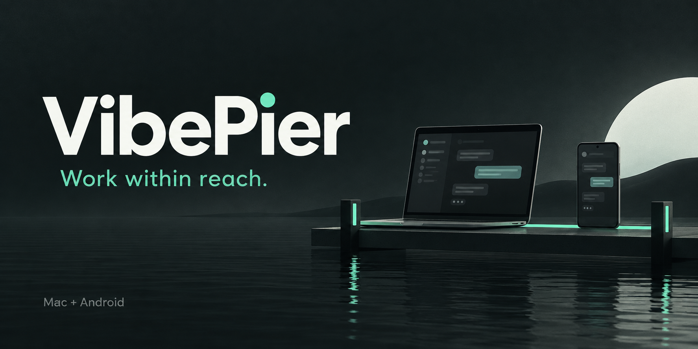

# VibePier: keep your Mac coding workspace within reach

> Launch draft; not posted publicly. Download links become available after the first public beta passes its release gates. The cover is concept artwork.

A coding task can keep running after you step away from the desk. Often the next interaction is small: read the latest result, add a detail, answer a question, or handle an approval. VibePier brings those supported interactions to an Android phone while the Mac remains the working environment.

The project combines a native Android companion, a macOS menu bar app, and an optional self-hosted relay. It is MIT-licensed, and the phone remote works without an AU05 hardware controller.

## Continue the supported session

Browse sessions by provider and project, read messages and tool activity, preserve a draft, and send a follow-up where the adapter supports it. Supported approval and question cards can be answered from the phone. Unsupported or ambiguous actions ask you to finish on the Mac.

The provider boundaries are explicit. Codex uses the original desktop session and follow-up queue, with a strict desktop-build check. Claude Code distinguishes desktop and terminal ownership; it refuses to start a competing continuation beside an active terminal session.

The [compatibility table](../COMPATIBILITY.md) records these differences. A readable history does not imply that every desktop action is available remotely. A request whose outcome is uncertain also remains uncertain: the app keeps its identity and receipt instead of silently submitting a duplicate.

## Keep familiar controls nearby

The remote screen offers six configurable controls, general or per-application shortcuts, and a stable dock of Mac applications. A large voice button supports a held gesture; releasing or leaving the gesture ends it.

Voice controls use the Mac microphone by default. Optional phone microphone input requires BlackHole 2ch on the Mac and Android recording permission. Routing is temporary for the voice action and restores the previous input afterward. Phone audio uses Bluetooth, local Wi-Fi or an established UDP direct path; a relay-only connection does not carry that audio.

The session menu also offers Lock and Unlock. Unlocking is separately configured: the Mac validates the login password and keeps it in private local Mac preferences, preserved across app updates. Explicit Unlock leaves the desktop unlocked, while temporary unlock for a desktop operation restores the lock after the relevant operations finish.

## Choose how the devices connect

First enrollment starts over Bluetooth. The phone requests approval automatically, and you confirm on the Mac. Each phone has its own authorization. After that, choose Bluetooth, local Wi-Fi or your own WSS relay.

The relay is a small Go service with no database. The README includes build and systemd commands, an Nginx route, private secret import, and connection checks. Approved Bluetooth enrollment lets the phone receive the relay setup securely. VibePier does not operate a public relay service; cross-network availability depends on your deployment and network.

Control traffic uses authenticated encryption, and provider credentials remain on the Mac. Relay operators can still observe connection metadata and encrypted traffic sizes. The phone retains encrypted conversation caches and drafts. The [privacy guide](../PRIVACY.md) explains those boundaries without treating encryption as a promise of invisibility or an independent security audit.

## Built to be inspected and maintained

The repository separates the Mac app, Android app, relay, protocol fixtures, branding and release scripts. Native source, build commands, tests, editable icon geometry and original concept artwork are included. The upstream MIT attribution is preserved even though the new repository starts with a consolidated initial commit.

The first beta targets Apple-silicon Macs and Android phones. The Mac preview is not notarized. Desktop provider interfaces can change, and there is no iOS client, Windows host or remote power-on support. The release checklist distinguishes implemented features, simulated tests and real-device acceptance.

Start with [installation and pairing](../SETUP.md), use the [README relay instructions](../../README.md#deploy-your-own-relay) for your own deployment, or read [how to contribute](../../CONTRIBUTING.md) to help with adapters, device testing and documentation.
